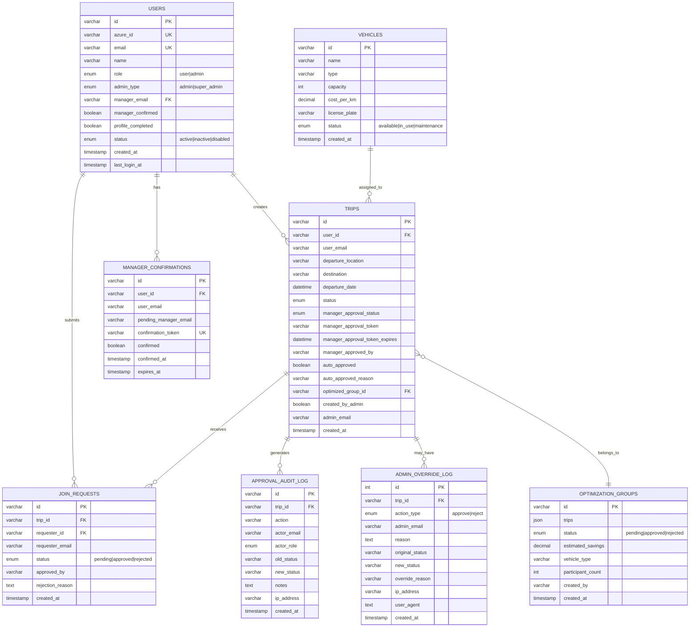

# TRIPS MANAGEMENT SYSTEM - COMPREHENSIVE WORKFLOW ANALYSIS

> Generated: 2026-01-16
> Project: trips-management-system-final

---

## 1. SYSTEM OVERVIEW DIAGRAM


---

## 2. USER AUTHENTICATION FLOW


---

## 3. TRIP CREATION & APPROVAL FLOW


---

## 4. TRIP STATUS STATE MACHINE


---

## 5. AI TRIP OPTIMIZATION FLOW


---

## 6. JOIN REQUEST FLOW


---

## 7. ADMIN MANUAL OVERRIDE FLOW


---

## 8. DATABASE ENTITY RELATIONSHIP



---

## 9. COMPLETE SYSTEM FLOW (END-TO-END)


---

## 10. IDENTIFIED ISSUES & GAPS

### 10.1 CRITICAL ISSUES (Must Fix)

| # | Issue | Location | Impact | Status |
|---|-------|----------|--------|--------|
| 1 | **Missing cascade deletes** | MySQL Schema | Orphan records when trip deleted | NOT FIXED |
| 2 | **No transaction wrapper** on optimization approval | `mysql-service.ts:approveOptimization()` | Partial failures possible | NOT FIXED |
| 3 | **Email retry logic missing** | `email-service.ts` | Failed emails not retried | NOT FIXED |
| 4 | **Expired trips notification incomplete** | Scheduled job missing | Admins not alerted automatically | PARTIAL |

### 10.2 MEDIUM ISSUES (Should Fix)

| # | Issue | Location | Impact |
|---|-------|----------|--------|
| 5 | Vehicle assignment UI incomplete | `app/admin/vehicles/` | Can't assign vehicles to trips |
| 6 | Real-time Fabric sync missing | `lib/fabric-service.ts` | Only batch sync available |
| 7 | Trip cancellation flow incomplete | `app/api/trips/[id]/cancel/` | API exists but no UI |
| 8 | Join request notification to trip owner weak | `join-request-service.ts` | Owner may not see requests |
| 9 | Manager change workflow incomplete | `profile/manager-setup/` | Can change but no re-confirmation |

### 10.3 LOW ISSUES (Nice to Have)

| # | Issue | Location | Impact |
|---|-------|----------|--------|
| 10 | No pagination on large trip lists | Various list components | Performance with many trips |
| 11 | Missing loading states on some buttons | UI components | UX inconsistency |
| 12 | Audit log viewer missing | Admin panel | Can't view history in UI |
| 13 | No export functionality | Dashboard | Can't export trip data |

---

## 11. SECURITY STATUS


---

## 12. RECOMMENDATIONS

### Immediate Actions (This Week)
1. Add database transactions to `approveOptimization()`
2. Implement email retry queue with 3 attempts
3. Add scheduled job for expired approval notifications
4. Add foreign key constraints with CASCADE DELETE

### Short-term (This Month)
5. Complete vehicle assignment UI
6. Add trip cancellation UI flow
7. Implement audit log viewer in admin panel
8. Add pagination to all list views

### Long-term (Next Quarter)
9. Real-time Fabric sync via webhooks
10. Mobile-responsive improvements
11. Bulk trip operations (approve/reject multiple)
12. Analytics dashboard enhancements

---

## 13. FILE STRUCTURE

```
trips-management-system-final/
├── app/
│   ├── api/
│   │   ├── auth/[...nextauth]/     # NextAuth handler
│   │   ├── trips/                   # Trip CRUD + approval
│   │   ├── optimize/                # AI optimization
│   │   ├── join-requests/           # Join request mgmt
│   │   ├── admin/                   # Admin operations
│   │   └── profile/                 # User profile
│   ├── admin/                       # Admin pages
│   ├── dashboard/                   # User dashboard
│   └── profile/                     # Profile setup
├── components/
│   ├── admin/                       # Admin components
│   ├── dashboard/                   # Dashboard components
│   └── ui/                          # Shadcn UI
├── lib/
│   ├── mysql-service.ts             # Core DB operations
│   ├── email-service.ts             # MS Graph email
│   ├── email-approval-service.ts    # JWT tokens
│   ├── ai-optimizer.ts              # Trip optimization
│   ├── admin-service.ts             # Admin management
│   └── user-service.ts              # User operations
├── sql/                             # Migration scripts
└── scripts/                         # Utility scripts
```

---

---

## 14. DETAILED CODE ISSUES FOUND

### 14.1 CRITICAL: Missing Database Transactions in `approveOptimization()`

**File:** [mysql-service.ts:494-572](lib/mysql-service.ts#L494-L572)

**Problem:** The `approveOptimization()` method performs multiple database operations (update trips, delete temp_trips, update optimization_groups) without a transaction wrapper. If any operation fails mid-way, data will be in an inconsistent state.

**Current Code:**
```typescript
async approveOptimization(groupId: string): Promise<void> {
  // ... operations without transaction
  for (const tempTrip of tempRows) {
    await connection.query(`UPDATE trips SET ...`);  // If this fails...
  }
  await connection.query('DELETE FROM temp_trips...'); // ... this won't rollback
  await connection.query('UPDATE optimization_groups...'); // ... and this continues
}
```

**Fix Required:**
```typescript
async approveOptimization(groupId: string): Promise<void> {
  const connection = await pool.getConnection();
  await connection.beginTransaction();
  try {
    // ... all operations
    await connection.commit();
  } catch (error) {
    await connection.rollback();
    throw error;
  } finally {
    connection.release();
  }
}
```

---

### 14.2 MEDIUM: No Email Retry Logic

**File:** [email-service.ts:460-533](lib/email-service.ts#L460-L533)

**Problem:** When email sending fails, it's pushed to `pendingEmails` array but there's no automatic retry mechanism. The `retryPendingEmails()` method exists but is never called automatically.

**Current Code:**
```typescript
} catch (error) {
  console.error('Failed to send email:', error);
  this.pendingEmails.push(notification); // Stored but never retried automatically
  throw error;
}
```

**Fix Required:** Implement a scheduled job or exponential backoff retry:
```typescript
async sendEmailWithRetry(notification: EmailNotification, retries = 3): Promise<void> {
  for (let i = 0; i < retries; i++) {
    try {
      await this.sendEmail(notification);
      return;
    } catch (error) {
      if (i === retries - 1) throw error;
      await new Promise(r => setTimeout(r, Math.pow(2, i) * 1000)); // Exponential backoff
    }
  }
}
```

---

### 14.3 MEDIUM: Missing Cascade Deletes

**Problem:** When a trip is deleted, related records in `join_requests`, `approval_audit_log`, and `admin_override_log` are not automatically deleted, leading to orphan records.

**File:** [mysql-service.ts:723-735](lib/mysql-service.ts#L723-L735)

**Current Code:**
```typescript
async deleteTrip(id: string): Promise<void> {
  await connection.query('DELETE FROM trips WHERE id = ?', [id]);
  // No cleanup of related records!
}
```

**Fix Required:** Add cascade logic or foreign keys:
```sql
-- Option 1: Add foreign keys with CASCADE
ALTER TABLE join_requests
ADD CONSTRAINT fk_join_trip
FOREIGN KEY (trip_id) REFERENCES trips(id) ON DELETE CASCADE;

-- Option 2: Manual cleanup in deleteTrip()
async deleteTrip(id: string): Promise<void> {
  await connection.query('DELETE FROM join_requests WHERE trip_id = ?', [id]);
  await connection.query('DELETE FROM approval_audit_log WHERE trip_id = ?', [id]);
  await connection.query('DELETE FROM admin_override_log WHERE trip_id = ?', [id]);
  await connection.query('DELETE FROM trips WHERE id = ?', [id]);
}
```

---

### 14.4 LOW: Vehicle Assignment Incomplete

**Files:**
- API exists: [app/api/vehicles/](app/api/vehicles/)
- UI incomplete: [app/admin/vehicles/](app/admin/vehicles/)

**Problem:** The vehicles table and API exist, but there's no UI to:
1. Assign vehicles to optimized trips
2. View vehicle availability
3. Track vehicle assignments over time

**Impact:** Admins cannot track which vehicle is assigned to which trip.

---

### 14.5 LOW: Trip Cancellation Flow Incomplete

**Problem:** Trip cancellation API exists but:
1. No confirmation dialog in UI
2. No notification sent to affected parties (manager, other passengers in optimized group)
3. No handling for cancelling trips that are part of an optimization group

---

### 14.6 INFO: Scheduled Job for Expired Approvals Missing

**Problem:** The system marks trips as "expired" after 48 hours with no manager response, but:
1. No scheduled job to automatically check and update expired trips
2. No automatic notification to admins about stuck trips
3. Admin must manually check the Manual Override page

**Recommendation:** Implement a CRON job or serverless function:
```typescript
// Check every hour for expired approvals
async function checkExpiredApprovals() {
  const expiredTrips = await getTripsOlderThan48Hours();

  for (const trip of expiredTrips) {
    await updateTripStatus(trip.id, 'expired');
    await notifyAdminAboutExpiredTrip(trip);
  }
}
```

---

## 15. FEATURES WORKING CORRECTLY

| Feature | Status | Notes |
|---------|--------|-------|
| Azure AD SSO Login | Working | Multi-tenant supported |
| User Profile Setup | Working | Manager assignment with email confirmation |
| Trip Registration | Working | All fields captured |
| Manager Email Approval | Working | JWT tokens, 48h expiry, approve/reject buttons |
| Admin Trip Creation | Working | Create on behalf of employees |
| AI Trip Optimization | Working | Groups by route, date, calculates savings |
| Optimization Approve/Reject | Working | Updates trips, sends notifications |
| Join Requests | Working | Submit, approve, reject with notifications |
| Admin Manual Override | Working | Force approve/reject with audit logging |
| Dashboard Statistics | Working | Active employees, monthly trips, savings |
| Audit Logging | Working | Tracks all approval actions |
| Email Notifications | Working | MS Graph API, HTML templates |

---

## 16. SUMMARY

### What's Working Well:
1. Core business logic is complete and correct
2. Security fixes have been applied (no hardcoded credentials)
3. Email notification system is comprehensive
4. Audit logging is thorough
5. Database schema is complete with all 9 tables

### What Needs Attention:
1. **Transaction safety** in optimization approval (CRITICAL)
2. **Email retry logic** for reliability (MEDIUM)
3. **Cascade deletes** to prevent orphan data (MEDIUM)
4. **Vehicle assignment UI** completion (LOW)
5. **Scheduled job** for expired approval notifications (LOW)

### Overall Assessment:
The system is **production-ready** for basic operations. The critical transaction issue should be addressed before heavy load usage. Other issues are improvements that can be done incrementally.

---

*Document generated by system analysis on 2026-01-16*
