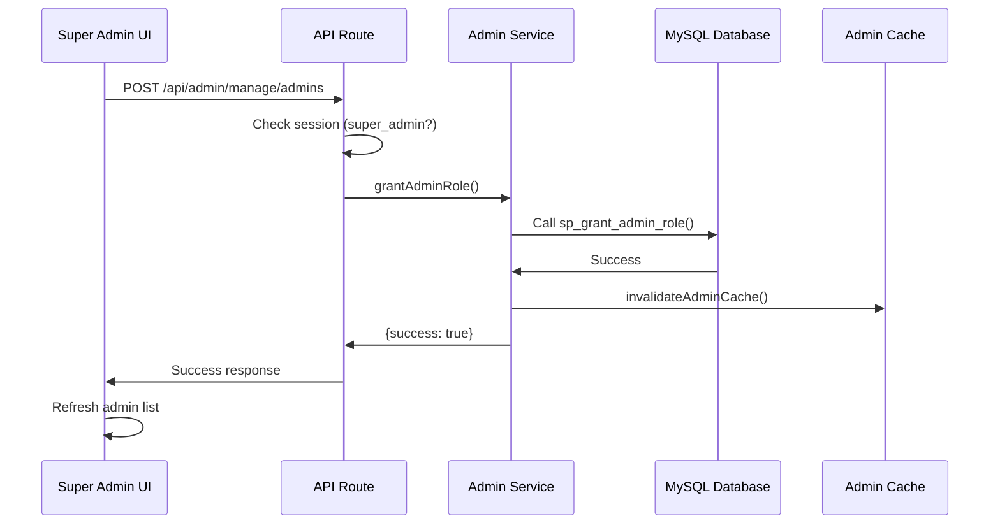

# Super Admin UI Guide

**Version:** v02.08
**Last Updated:** 2025-12-31

---

## Overview

The Super Admin UI provides a web-based interface for managing admin roles in the Trips Management System. This eliminates the need to run manual scripts or edit code to grant/revoke admin permissions.

## Access

**URL:** `/admin/manage-admins`

**Requirements:**
- Must be logged in with `super_admin` role
- Only `ngan.ngo@intersnack.com.vn` has super_admin access by default

**Navigation:**
- After logging in as super_admin, you'll see "Manage Admins" link in the top navigation bar

---

## Features

### 1. Statistics Dashboard

The page displays 4 key metrics cards:
- **Total Admins** - Total number of admin users
- **Super Admins** - Number of super admins (system-wide access)
- **Location Admins** - Number of location-specific admins
- **Active Locations** - Number of locations with assigned admins

### 2. Admin List Table

Displays all current admins with:
- Name
- Email
- Admin Type (Super Admin / Location Admin)
- Assigned Location (for location admins)
- Date assigned as admin
- Actions (Revoke button)

**Self-Protection:** You cannot revoke your own admin role (button is disabled)

### 3. Grant Admin Role

Click "Grant Admin Role" button to open the grant dialog.

**Steps:**
1. **Search for User:**
   - Type email or name in the search box
   - Results appear as you type (minimum 2 characters)
   - Click on a user to select them

2. **Select Admin Type:**
   - **Super Admin** - Can manage all locations and other admins
   - **Location Admin** - Can only manage specific location

3. **Assign Location** (if Location Admin):
   - Select the location from dropdown
   - Shows: `CODE - Name (Province)`
   - Example: `TN - Tay Ninh Factory (Tay Ninh)`

4. **Add Reason (Optional):**
   - Explain why you're granting admin role
   - This is logged for audit purposes

5. **Click "Grant Admin Role"**
   - Confirmation alert will appear
   - Page refreshes with updated admin list

### 4. Revoke Admin Role

Click "Revoke" button next to any admin to revoke their access.

**Steps:**
1. Confirmation dialog shows:
   - User's name and email
   - Warning that you're revoking their admin access

2. **Add Reason (Optional):**
   - Explain why you're revoking admin role
   - This is logged for audit purposes

3. **Click "Revoke Admin Role"**
   - Confirmation alert will appear
   - Page refreshes with updated admin list
   - User is converted back to regular user

**Protection:** You cannot revoke your own admin role

---

## Current Admins (As of 2025-12-31)

| Email | Name | Admin Type | Location |
|-------|------|------------|----------|
| `ngan.ngo@intersnack.com.vn` | Ngan Ngo | Super Admin | All Locations |
| `yen.pham@intersnack.com.vn` | Yen Pham | Location Admin | Tay Ninh Factory |
| `nhung.cao@intersnack.com.vn` | Nhung Cao | Location Admin | Phan Thiet Factory |
| `chi.huynh@intersnack.com.vn` | Chi Huynh | Location Admin | Long An Factory |
| `anh.do@intersnack.com.vn` | Anh Do | Location Admin | Ho Chi Minh Office |

---

## Use Cases

### Grant Admin to New Office Admin

**Scenario:** Yen Pham is the new Office Admin for Long An Factory

1. Login as `ngan.ngo@intersnack.com.vn` (super admin)
2. Navigate to `/admin/manage-admins`
3. Click "Grant Admin Role"
4. Search for "yen.pham@intersnack.com.vn"
5. Select user from search results
6. Choose "Location Admin (Specific Location)"
7. Select "Long An Factory" from location dropdown
8. Add reason: "New Office Admin - Long An"
9. Click "Grant Admin Role"
10. Verify Yen appears in admin list with Long An assignment

### Revoke Admin When Employee Leaves

**Scenario:** Nhung Cao is leaving the company

1. Login as `ngan.ngo@intersnack.com.vn` (super admin)
2. Navigate to `/admin/manage-admins`
3. Find "nhung.cao@intersnack.com.vn" in the admin list
4. Click "Revoke" button
5. Add reason: "Employee resignation"
6. Click "Revoke Admin Role"
7. Verify Nhung no longer appears in admin list

### Change Admin Type

**Scenario:** Promote Yen Pham from Location Admin to Super Admin

1. First, revoke current location admin role:
   - Click "Revoke" on Yen's row
   - Reason: "Promotion to Super Admin"

2. Then, grant super admin role:
   - Click "Grant Admin Role"
   - Search for "yen.pham@intersnack.com.vn"
   - Select "Super Admin (All Locations)"
   - Reason: "Promoted to Super Admin"
   - Click "Grant Admin Role"

---

## Technical Details

### Admin Role Hierarchy

```
super_admin
├── Can manage all locations
├── Can grant/revoke admin roles
├── Can assign location admins
├── Can promote users to super admin
└── Full system access

location_admin
├── Can manage trips for assigned location only
├── Can view statistics for assigned location
├── Can export trips for assigned location
└── Cannot grant/revoke admin roles
```

### Data Flow



### Database Changes

When granting admin role:
```sql
-- Updates users table
UPDATE users
SET role = 'admin',
    admin_type = 'location_admin',
    admin_location_id = 'loc-tay-ninh-factory'
WHERE email = 'yen.pham@intersnack.com.vn';

-- Creates audit log entry
INSERT INTO admin_audit_log (...) VALUES (...);
```

When revoking admin role:
```sql
-- Updates users table
UPDATE users
SET role = 'user',
    admin_type = 'none',
    admin_location_id = NULL
WHERE email = 'yen.pham@intersnack.com.vn';

-- Creates audit log entry
INSERT INTO admin_audit_log (...) VALUES (...);
```

### Cache Invalidation

Admin email cache (5-minute TTL) is automatically invalidated when:
- ✅ Granting admin role
- ✅ Revoking admin role

This ensures authentication checks use fresh admin list immediately after changes.

---

## Troubleshooting

### Error: "Forbidden - Super Admin access required"

**Cause:** You're not logged in as super_admin

**Solution:**
1. Check your current role: Look at the badge in header (should say "Admin")
2. Logout and login again as `ngan.ngo@intersnack.com.vn`
3. If still failing, check database:
   ```bash
   node -e "
   const mysql = require('mysql2/promise');
   require('dotenv').config({ path: '.env.local' });

   async function check() {
     const conn = await mysql.createConnection({...});
     const [rows] = await conn.query('SELECT email, admin_type FROM users WHERE email = ?', ['ngan.ngo@intersnack.com.vn']);
     console.table(rows);
     await conn.end();
   }
   check();
   "
   ```

### Error: "Target user not found"

**Cause:** User doesn't exist in the system yet

**Solution:**
- User must login at least once to create their account
- After first SSO login, they'll appear in user search

### Error: "Location not found or inactive"

**Cause:** Selected location doesn't exist or is inactive

**Solution:**
1. Check available locations:
   ```bash
   node -e "
   const mysql = require('mysql2/promise');
   require('dotenv').config({ path: '.env.local' });

   async function check() {
     const conn = await mysql.createConnection({...});
     const [rows] = await conn.query('SELECT id, name, code, active FROM locations');
     console.table(rows);
     await conn.end();
   }
   check();
   "
   ```
2. Use only active locations from the dropdown

### UI not showing updated admin list

**Cause:** Browser cache or stale data

**Solution:**
- Click "Refresh" button on the page
- Hard refresh browser: Ctrl+Shift+R (Windows) or Cmd+Shift+R (Mac)
- Clear browser cache

---

## Security Considerations

### Self-Protection
- ✅ Users cannot revoke their own admin role
- ✅ Prevents accidental lockout

### Authorization
- ✅ All endpoints check for super_admin role
- ✅ Non-super-admins get 403 Forbidden
- ✅ Unauthenticated users get 401 Unauthorized

### Audit Trail
- ✅ All grant/revoke actions are logged
- ✅ Tracks: who, what, when, why, IP address, user agent
- ✅ View audit log at `/api/admin/manage/audit-log`

### Input Validation
- ✅ Email format validation
- ✅ Admin type validation (only super_admin or location_admin)
- ✅ Location ID validation for location admins
- ✅ Prevents SQL injection via prepared statements

---

## Next Steps After Granting Admin

After granting admin role, the new admin should:

1. **Logout and Login Again:**
   - Admin cache will refresh
   - New role will be active in session

2. **Verify Access:**
   - Check that "Admin Dashboard" link appears in navigation
   - For super_admin: "Manage Admins" link should appear
   - For location_admin: Only assigned location trips visible

3. **Test Permissions:**
   - Try accessing admin pages
   - Verify location-specific access (for location admins)
   - Confirm ability to approve/manage trips

---

## API Documentation

For developers integrating with the Admin Management API:

### GET /api/admin/manage/admins

Get all admins:
```bash
curl -H "Cookie: next-auth.session-token=..." \
  https://your-domain.com/api/admin/manage/admins
```

Search users:
```bash
curl -H "Cookie: next-auth.session-token=..." \
  "https://your-domain.com/api/admin/manage/admins?action=search&query=yen&excludeAdmins=true"
```

### POST /api/admin/manage/admins

Grant admin role:
```bash
curl -X POST \
  -H "Content-Type: application/json" \
  -H "Cookie: next-auth.session-token=..." \
  -d '{
    "targetUserEmail": "yen.pham@intersnack.com.vn",
    "adminType": "location_admin",
    "locationId": "loc-tay-ninh-factory",
    "reason": "New Office Admin"
  }' \
  https://your-domain.com/api/admin/manage/admins
```

### DELETE /api/admin/manage/admins

Revoke admin role:
```bash
curl -X DELETE \
  -H "Cookie: next-auth.session-token=..." \
  "https://your-domain.com/api/admin/manage/admins?email=yen.pham@intersnack.com.vn&reason=Employee+resignation"
```

---

## Support

If you encounter issues:
1. Check [ADMIN-SETUP-COMPLETE.md](./ADMIN-SETUP-COMPLETE.md) for setup details
2. Review [WORKFLOW-ANALYSIS.md](./WORKFLOW-ANALYSIS.md) for system architecture
3. Check console logs: `pm2 logs`
4. Verify database connection and admin records

---

**Document maintained by:** Development Team
**For questions contact:** ngan.ngo@intersnack.com.vn
