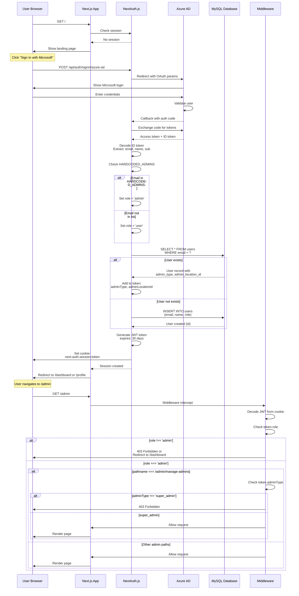
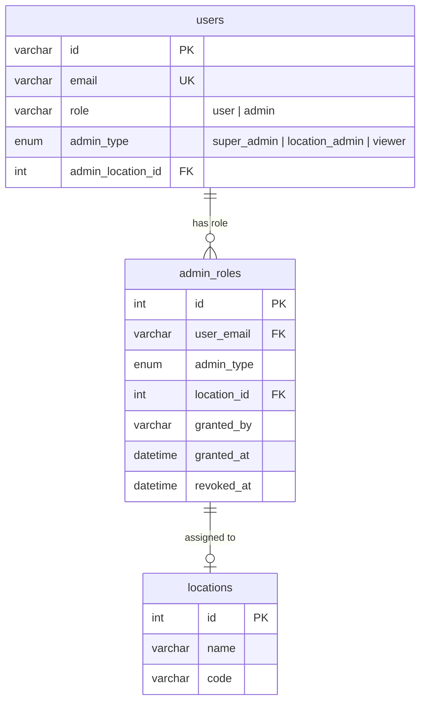
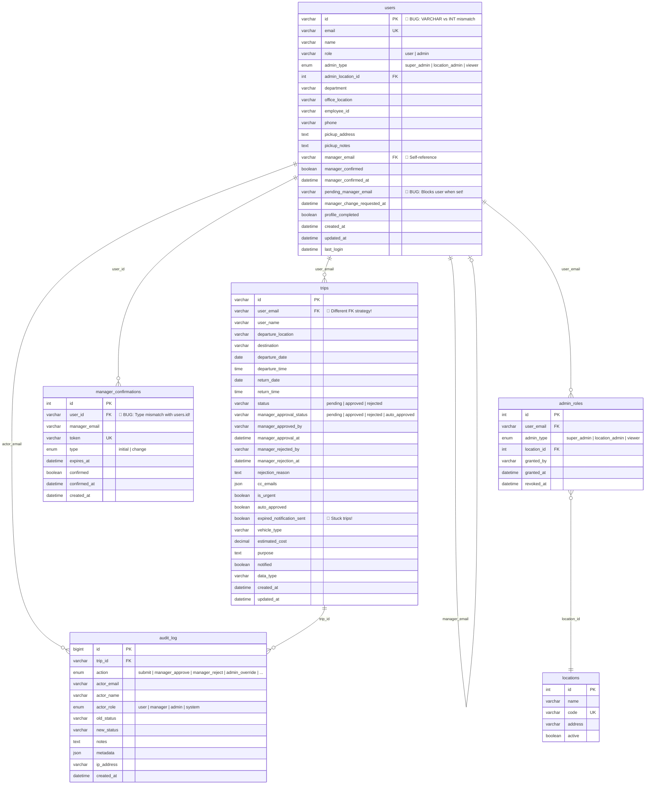

# PHÂN TÍCH WORKFLOW CHI TIẾT - TRIPS MANAGEMENT SYSTEM

**Ngày phân tích:** 2025-12-31
**Phiên bản:** v02.07 (chưa phân quyền admin hoàn chỉnh)
**Người phân tích:** Claude AI

---

## MỤC LỤC

1. [Workflow Tổng Quan Toàn Hệ Thống](#i-workflow-tổng-quan-toàn-hệ-thống)
2. [Authentication & Authorization Flow](#ii-authentication--authorization-flow)
3. [Profile Setup & Manager Verification](#iii-profile-setup--manager-verification-flow)
4. [Trip Submission & Approval](#iv-trip-submission--approval-workflow)
5. [Email Routing & Notification System](#v-email-routing--notification-system)
6. [Admin Permission System](#vi-admin-permission-system)
7. [Database Schema & Relationships](#vii-database-schema--relationships)
8. [Critical Bugs Detected](#viii-critical-bugs-detected-🔴)
9. [Logic Conflicts & Issues](#ix-logic-conflicts--issues-⚠️)
10. [Security Vulnerabilities](#x-security-vulnerabilities-🔒)

---

## I. WORKFLOW TỔNG QUAN TOÀN HỆ THỐNG

```mermaid
flowchart TB
    Start([👤 User truy cập app]) --> CheckAuth{Đã login?}

    CheckAuth -->|Chưa| LoginPage[🏠 Landing Page]
    LoginPage --> ClickLogin[Click "Sign In with Microsoft"]
    ClickLogin --> AzureRedirect[↗️ Redirect to Azure AD]

    AzureRedirect --> AzureAuth[🔐 Azure AD Authentication]
    AzureAuth -->|Success| AzureCallback[Callback với auth code]
    AzureAuth -->|Failed| LoginError[❌ Login Error]

    AzureCallback --> ValidateDomain{Email domain<br/>hợp lệ?}
    ValidateDomain -->|Không<br/>!= @intersnack.com.vn| DomainError[❌ Domain Error:<br/>Chỉ cho phép email công ty]
    ValidateDomain -->|Có| CreateSession[✅ Tạo NextAuth Session]

    CreateSession --> CheckHardcodedAdmin{Email trong<br/>HARDCODED_ADMINS?}
    CheckHardcodedAdmin -->|Có| SetRoleAdmin[Set role = 'admin']
    CheckHardcodedAdmin -->|Không| SetRoleUser[Set role = 'user']

    SetRoleAdmin --> CheckUserExists
    SetRoleUser --> CheckUserExists{User trong<br/>database?}

    CheckUserExists -->|Không| InsertUser[INSERT vào users table<br/>admin_type = NULL]
    CheckUserExists -->|Có| FetchAdminType[SELECT admin_type,<br/>admin_location_id]

    InsertUser --> AddSessionData
    FetchAdminType --> AddSessionData[Add adminType, adminLocationId<br/>vào JWT token]

    AddSessionData --> GenerateJWT[Generate JWT Token<br/>expires in 30 days]
    GenerateJWT --> SetCookie[Set cookie:<br/>next-auth.session-token]

    SetCookie --> CheckAuth
    CheckAuth -->|Có session| Middleware[🛡️ Middleware Check]

    Middleware --> CheckProfileComplete{profile_completed?}
    CheckProfileComplete -->|FALSE| ProfileSetupPage[📝 Profile Setup Page]
    CheckProfileComplete -->|TRUE| CheckRole{Role?}

    CheckRole -->|admin| AdminDashboard[👑 Admin Dashboard]
    CheckRole -->|user| UserDashboard[📊 User Dashboard]

    ProfileSetupPage --> FillForm[User điền form:<br/>- Department<br/>- Office Location<br/>- Phone<br/>- Pickup Address<br/>- Manager Email optional]

    FillForm --> SubmitProfile[POST /api/profile/setup]

    SubmitProfile --> HasManagerEmail{Có nhập<br/>Manager Email?}

    HasManagerEmail -->|KHÔNG<br/>CEO/Founder| AutoApprove[UPDATE users:<br/>manager_email = NULL<br/>manager_confirmed = TRUE<br/>profile_completed = TRUE]

    HasManagerEmail -->|CÓ| ValidateManagerEmail[Validate:<br/>1. Domain hợp lệ<br/>2. Không phải chính mình]

    ValidateManagerEmail -->|Invalid| ValidationError[❌ Validation Error]
    ValidateManagerEmail -->|Valid| SetPendingManager[UPDATE users:<br/>pending_manager_email = X<br/>manager_confirmed = FALSE<br/>profile_completed = TRUE]

    SetPendingManager --> GenToken[Generate crypto token<br/>32 bytes random hex]
    GenToken --> InsertConfirmation[INSERT manager_confirmations:<br/>user_id, manager_email,<br/>token, expires_at (+7 days)]

    InsertConfirmation --> SendConfirmEmail[📧 Send confirmation email<br/>to pending_manager_email]

    SendConfirmEmail --> WaitConfirm[⏳ Đợi Manager click link]

    AutoApprove --> UserDashboard

    WaitConfirm --> ManagerClick{Manager action?}

    ManagerClick -->|Không click<br/>7 ngày| TokenExpired[🔴 Token expired<br/>User phải request lại]
    ManagerClick -->|Click Reject| RejectManager[DELETE confirmation<br/>Send email reject to user]
    ManagerClick -->|Click Approve| ConfirmManager[UPDATE users:<br/>manager_email = pending<br/>manager_confirmed = TRUE<br/>pending_manager_email = NULL]

    ConfirmManager --> SendSuccess[📧 Send success email<br/>to user]
    RejectManager --> ProfileSetupPage

    SendSuccess --> UserDashboard

    UserDashboard --> UserActions{User Action?}
    UserActions -->|Submit Trip| TripFlow[🚗 Go to Trip Flow]
    UserActions -->|Change Manager| ChangeFlow[🔄 Go to Change Manager Flow]
    UserActions -->|View Trips| ViewTrips[📋 My Trips Page]

    AdminDashboard --> AdminActions{Admin Action?}
    AdminActions -->|View All Trips| AllTrips[📊 All Trips Table]
    AdminActions -->|Export Data| Export[📥 Export Excel/CSV]
    AdminActions -->|Manage Admins| ManageAdmins{adminType =<br/>super_admin?}

    ManageAdmins -->|Không| Forbidden403[🔒 403 Forbidden]
    ManageAdmins -->|Có| AdminManagement[👥 Admin Management UI]

    TripFlow --> TripWorkflow[See Trip Submission Flow]
    ChangeFlow --> ChangeManagerWorkflow[See Change Manager Flow]

    DomainError --> LoginPage
    LoginError --> LoginPage
    ValidationError --> ProfileSetupPage
    TokenExpired --> ProfileSetupPage

    style LoginError fill:#ff6b6b,stroke:#c92a2a,color:#fff
    style DomainError fill:#ff6b6b,stroke:#c92a2a,color:#fff
    style ValidationError fill:#ff6b6b,stroke:#c92a2a,color:#fff
    style TokenExpired fill:#ffa502,stroke:#e67700
    style AutoApprove fill:#26de81,stroke:#20bf6b,color:#fff
    style ConfirmManager fill:#26de81,stroke:#20bf6b,color:#fff
    style Forbidden403 fill:#ff6b6b,stroke:#c92a2a,color:#fff
    style CheckHardcodedAdmin fill:#ffa502,stroke:#e67700
```

---

## II. AUTHENTICATION & AUTHORIZATION FLOW



### 🔴 **BUG PHÁT HIỆN: Hardcoded Admin List**

```typescript
// middleware.ts, lines 26-30
const ADMIN_EMAILS = [
  'admin@intersnack.com.vn',
  'manager@intersnack.com.vn',
  'operations@intersnack.com.vn'
];
```

**Vấn đề:**
- ❌ Chỉ 3 email được hardcode
- ❌ Không thể thêm admin mới qua UI
- ❌ Phải redeploy code để thay đổi
- ❌ Không có Super Admin UI để quản lý (mặc dù DB có admin_roles table)

**Giải pháp:**
```typescript
// Đọc từ database thay vì hardcode
async function getAdminEmails(): Promise<string[]> {
  const [admins] = await connection.query(`
    SELECT user_email FROM admin_roles
    WHERE revoked_at IS NULL
  `);
  return admins.map(a => a.user_email);
}
```

---

## III. PROFILE SETUP & MANAGER VERIFICATION FLOW

```mermaid
stateDiagram-v2
    [*] --> NewUserLogin: User first login

    NewUserLogin --> ProfileIncomplete: profile_completed = FALSE
    ProfileIncomplete --> ShowSetupWizard: Display setup wizard

    ShowSetupWizard --> UserFillsForm: User enters:<br/>- Department<br/>- Office Location<br/>- Phone<br/>- Pickup Address<br/>- Manager Email (optional)

    UserFillsForm --> CheckManagerField: Check manager_email

    state CheckManagerField <<choice>>
    CheckManagerField --> NoManager: manager_email = NULL
    CheckManagerField --> HasManager: manager_email = X

    NoManager --> CEOPath: CEO/C-Level Path
    HasManager --> ManagerVerificationPath: Manager Verification Path

    state CEOPath {
        [*] --> UpdateUserCEO: UPDATE users SET<br/>manager_email = NULL<br/>manager_confirmed = TRUE<br/>profile_completed = TRUE
        UpdateUserCEO --> CEOComplete: ✅ Can submit trips immediately
        CEOComplete --> [*]
    }

    state ManagerVerificationPath {
        [*] --> ValidateEmail: Validate manager email
        ValidateEmail --> EmailValid: Domain OK + Not self
        EmailValid --> UpdateUserPending: UPDATE users SET<br/>pending_manager_email = X<br/>manager_confirmed = FALSE<br/>profile_completed = TRUE
        UpdateUserPending --> GenerateToken: crypto.randomBytes(32)
        GenerateToken --> StoreToken: INSERT manager_confirmations<br/>expires_at = NOW() + 7 days
        StoreToken --> SendEmail: 📧 Send confirmation email
        SendEmail --> WaitingState: ⏳ Waiting for manager

        state WaitingState {
            [*] --> PendingConfirmation
            PendingConfirmation --> CheckExpiry: Check expires_at

            state CheckExpiry <<choice>>
            CheckExpiry --> Expired: > 7 days
            CheckExpiry --> StillValid: < 7 days

            Expired --> ExpiredState: 🔴 Token expired<br/>User must request again
            StillValid --> AwaitingClick: Awaiting manager action

            AwaitingClick --> ManagerClicksLink: Manager opens email
        }

        ManagerClicksLink --> ManagerDecision

        state ManagerDecision <<choice>>
        ManagerDecision --> Approve: Click "Confirm"
        ManagerDecision --> Reject: Click "Reject"

        Approve --> ProcessApproval: UPDATE users SET<br/>manager_email = pending_email<br/>manager_confirmed = TRUE<br/>pending_manager_email = NULL
        ProcessApproval --> MarkConfirmed: UPDATE manager_confirmations<br/>confirmed = TRUE
        MarkConfirmed --> NotifyUserSuccess: 📧 Email to user:<br/>"Manager confirmed!"
        NotifyUserSuccess --> UserCanSubmit: ✅ User can submit trips

        Reject --> DeleteConfirmation: DELETE FROM<br/>manager_confirmations
        DeleteConfirmation --> NotifyUserReject: 📧 Email to user:<br/>"Manager rejected"
        NotifyUserReject --> MustChooseAgain: User must choose<br/>different manager

        UserCanSubmit --> [*]
        MustChooseAgain --> [*]
        ExpiredState --> [*]
    }

    CEOPath --> Dashboard
    ManagerVerificationPath --> Dashboard

    Dashboard --> [*]

    note right of ManagerVerificationPath
        🔴 CRITICAL BUG:
        Khi user có manager_confirmed = TRUE
        và request đổi manager mới,
        code set manager_confirmed = FALSE
        → User MẤT quyền submit trip ngay!

        File: /api/profile/change-manager
        Line: 83
    end note
```



### 🔴 **BUG #1: Manager Change Blocks User Immediately**

**Location:** `app/api/profile/change-manager/route.ts:83`

```typescript
// 🔴 BUG: Set FALSE ngay khi request change
await connection.query(
  `UPDATE users SET
    pending_manager_email = ?,
    manager_confirmed = FALSE,  // ← User mất quyền TỨC THÌ!
    manager_change_requested_at = NOW()
   WHERE email = ?`,
  [newManagerEmail, userEmail]
);
```

**Tình huống:**
1. User A có `manager_email = 'old@company.com'`, `manager_confirmed = TRUE` ✅
2. User A có thể submit trip bình thường ✅
3. User A request đổi sang manager mới: `pending_manager_email = 'new@company.com'`
4. Code set `manager_confirmed = FALSE` 🔴
5. User A **NGAY LẬP TỨC** không submit được trip! ❌
6. Nếu manager mới reject → User A **KẸT**, không thể submit trip!

**Test case:**
```bash
curl -X POST http://localhost:50001/api/profile/change-manager \
  -H "Content-Type: application/json" \
  -d '{
    "new_manager_email": "newboss@intersnack.com.vn",
    "reason": "Chuyển phòng ban"
  }'

# Kết quả: User NGAY LẬP TỨC mất quyền submit trip
# Dù manager cũ đã confirmed!
```

**Fix đề xuất:**

**Option 1: Keep old manager until new approves**
```typescript
// Chỉ set pending, GIỮ NGUYÊN manager_confirmed
await connection.query(
  `UPDATE users SET
    pending_manager_email = ?,
    manager_change_requested_at = NOW()
   WHERE email = ?`,
  [newManagerEmail, userEmail]
);
// Không đổi manager_confirmed!

// Khi manager mới approve:
await connection.query(
  `UPDATE users SET
    manager_email = pending_manager_email,
    pending_manager_email = NULL,
    manager_confirmed = TRUE
   WHERE email = ?`,
  [userEmail]
);
```

**Option 2: Add manager_change_status field**
```sql
ALTER TABLE users ADD COLUMN manager_change_status
  ENUM('none', 'pending', 'approved', 'rejected')
  DEFAULT 'none';

-- Logic check:
-- User can submit if:
--   (manager_confirmed = TRUE)
--   OR
--   (manager_confirmed = TRUE AND manager_change_status = 'pending')
```

---

## IV. TRIP SUBMISSION & APPROVAL WORKFLOW

```mermaid
flowchart TB
    Start([User clicks "Submit Trip"]) --> CheckSession{Authenticated?}
    CheckSession -->|No| Error401[❌ 401 Unauthorized]
    CheckSession -->|Yes| GetUser[Get user from DB]

    GetUser --> CheckProfileComplete{profile_completed<br/>= TRUE?}
    CheckProfileComplete -->|No| Error400a[❌ 400 Bad Request:<br/>Complete profile first]
    CheckProfileComplete -->|Yes| CheckManagerConfirmed{Has pending_manager?<br/>AND<br/>manager_confirmed = FALSE?}

    CheckManagerConfirmed -->|Yes| Error403[❌ 403 Forbidden:<br/>Manager not confirmed yet]
    CheckManagerConfirmed -->|No| ValidateFields{All required<br/>fields present?}

    ValidateFields -->|No| Error400b[❌ 400 Bad Request:<br/>Missing fields]
    ValidateFields -->|Yes| CalculateUrgent[Calculate:<br/>hours until departure]

    CalculateUrgent --> CheckHours{< 24 hours?}
    CheckHours -->|Yes| SetUrgent[is_urgent = TRUE]
    CheckHours -->|No| SetNormal[is_urgent = FALSE]

    SetUrgent --> CheckAutoApprove
    SetNormal --> CheckAutoApprove{user.manager_email<br/>is NULL?}

    CheckAutoApprove -->|Yes<br/>CEO/No Manager| AutoApprovePath[AUTO-APPROVE PATH]
    CheckAutoApprove -->|No<br/>Has Manager| NormalApprovalPath[NORMAL APPROVAL PATH]

    AutoApprovePath --> CreateTripApproved[INSERT trips:<br/>status = 'approved'<br/>manager_approval_status = 'approved'<br/>auto_approved = TRUE]

    CreateTripApproved --> LogAuditAuto[INSERT audit_log:<br/>action = 'submit'<br/>notes = 'Auto-approved']

    LogAuditAuto --> ReturnSuccess[✅ Return 200 OK:<br/>"Trip auto-approved"]

    NormalApprovalPath --> CreateTripPending[INSERT trips:<br/>status = 'pending'<br/>manager_approval_status = 'pending'<br/>auto_approved = FALSE]

    CreateTripPending --> GenApproveToken[Generate JWT:<br/>tripId, managerEmail,<br/>action='approve'<br/>expires in 48h]

    GenApproveToken --> GenRejectToken[Generate JWT:<br/>tripId, managerEmail,<br/>action='reject'<br/>expires in 48h]

    GenRejectToken --> BuildEmail[Build approval email HTML<br/>with action buttons]

    BuildEmail --> SendEmailToManager[📧 Send email to:<br/>user.manager_email]

    SendEmailToManager --> CheckUrgentFlag{is_urgent?}
    CheckUrgentFlag -->|Yes| SendAdminAlert[📧 Send alert to admin:<br/>"Urgent trip < 24h"]
    CheckUrgentFlag -->|No| LogAuditPending

    SendAdminAlert --> LogAuditPending[INSERT audit_log:<br/>action = 'submit'<br/>notes = 'Email sent to manager']

    LogAuditPending --> ReturnPending[✅ Return 200 OK:<br/>"Awaiting approval"]

    ReturnPending --> WaitManager[⏳ Waiting for manager]

    WaitManager --> ManagerAction{Manager clicks<br/>email link?}

    ManagerAction -->|No action<br/>48 hours| CheckExpiry[Check expired_notification_sent]

    CheckExpiry --> AlreadySent{Already sent?}
    AlreadySent -->|Yes| ReturnExpiredMsg[Return: Link expired]
    AlreadySent -->|No| SendExpiryEmail[📧 Send expiry notification<br/>to user + admin]

    SendExpiryEmail --> SetFlag[UPDATE trips:<br/>expired_notification_sent = TRUE]
    SetFlag --> TripStuckPending[🔴 Trip STUCK at 'pending'<br/>Không có auto-escalate!]

    ManagerAction -->|Click Approve| VerifyApproveToken{JWT token<br/>valid?}
    ManagerAction -->|Click Reject| VerifyRejectToken{JWT token<br/>valid?}

    VerifyApproveToken -->|No| InvalidToken1[❌ 400: Invalid/Expired token]
    VerifyRejectToken -->|No| InvalidToken2[❌ 400: Invalid/Expired token]

    VerifyApproveToken -->|Yes| ProcessApprove[UPDATE trips:<br/>status = 'approved'<br/>manager_approval_status = 'approved'<br/>manager_approved_by = email<br/>manager_approval_at = NOW]

    VerifyRejectToken -->|Yes| ProcessReject[UPDATE trips:<br/>status = 'rejected'<br/>manager_approval_status = 'rejected'<br/>manager_rejected_by = email<br/>manager_rejection_at = NOW]

    ProcessApprove --> LogApproveAudit[INSERT audit_log:<br/>action = 'manager_approve']
    ProcessReject --> LogRejectAudit[INSERT audit_log:<br/>action = 'manager_reject']

    LogApproveAudit --> SendApproveEmail[📧 Send to user:<br/>"Trip approved!"]
    LogRejectAudit --> SendRejectEmail[📧 Send to user:<br/>"Trip rejected"]

    SendApproveEmail --> CheckOptimization{Count approved trips<br/>same date/route<br/>>= 2?}

    CheckOptimization -->|Yes| TriggerAI[🤖 Trigger AI Optimization<br/>🔴 BUG: No throttle!]
    CheckOptimization -->|No| End1

    TriggerAI --> End1([End])
    SendRejectEmail --> End1
    ReturnSuccess --> End1
    TripStuckPending --> End1
    InvalidToken1 --> End1
    InvalidToken2 --> End1

    style Error401 fill:#ff6b6b,stroke:#c92a2a,color:#fff
    style Error400a fill:#ff6b6b,stroke:#c92a2a,color:#fff
    style Error400b fill:#ff6b6b,stroke:#c92a2a,color:#fff
    style Error403 fill:#ff6b6b,stroke:#c92a2a,color:#fff
    style InvalidToken1 fill:#ff6b6b,stroke:#c92a2a,color:#fff
    style InvalidToken2 fill:#ff6b6b,stroke:#c92a2a,color:#fff
    style TripStuckPending fill:#ffa502,stroke:#e67700
    style AutoApprovePath fill:#26de81,stroke:#20bf6b
    style CreateTripApproved fill:#26de81,stroke:#20bf6b
    style ProcessApprove fill:#26de81,stroke:#20bf6b
    style TriggerAI fill:#ffa502,stroke:#e67700
```

### ⚠️ **ISSUE #1: Expired Trips Stuck Forever**

**Problem:**
- Trip pending → Manager không click link sau 48h
- System gửi expired notification
- Set `expired_notification_sent = TRUE`
- Trip **VẪN Ở trạng thái `pending`** mãi mãi!
- ❌ Không có auto-escalate to admin
- ❌ Không có cơ chế resend link
- ❌ Không có auto-approve after X days

**Database evidence:**
```sql
SELECT
  id, user_email, status, manager_approval_status,
  expired_notification_sent,
  TIMESTAMPDIFF(HOUR, created_at, NOW()) as hours_stuck
FROM trips
WHERE status = 'pending'
  AND manager_approval_status = 'pending'
  AND expired_notification_sent = TRUE
  AND TIMESTAMPDIFF(DAY, created_at, NOW()) > 3;

-- Có bao nhiêu trips bị stuck > 3 ngày?
```

**Fix: Auto-Escalation Cron Job**
```typescript
// scripts/auto-escalate-expired-trips.js

const ESCALATION_THRESHOLD_HOURS = 72; // 3 days

async function escalateExpiredTrips() {
  const [trips] = await connection.query(`
    SELECT * FROM trips
    WHERE status = 'pending'
      AND manager_approval_status = 'pending'
      AND expired_notification_sent = TRUE
      AND TIMESTAMPDIFF(HOUR, created_at, NOW()) > ?
  `, [ESCALATION_THRESHOLD_HOURS]);

  for (const trip of trips) {
    // Option 1: Auto-approve after 3 days
    await connection.query(`
      UPDATE trips SET
        status = 'approved',
        manager_approval_status = 'auto_approved',
        notes = CONCAT(notes, '\n[Auto-approved: Manager non-response after 72h]')
      WHERE id = ?
    `, [trip.id]);

    // Log audit
    await logApprovalAction({
      tripId: trip.id,
      action: 'auto_approve_escalation',
      actorEmail: 'system',
      actorName: 'Auto-Escalation System',
      actorRole: 'system',
      newStatus: 'approved',
      notes: 'Auto-approved due to manager non-response after 72 hours'
    });

    // Notify user
    await sendEmail({
      to: trip.user_email,
      subject: 'Trip Auto-Approved (Manager Non-Response)',
      html: `Your trip has been automatically approved...`
    });
  }
}

// Add to cron:
cron.schedule('0 */6 * * *', escalateExpiredTrips); // Every 6 hours
```

### 🔴 **BUG #2: No Rate Limiting on AI Optimization**

**Location:** `/api/trips/approve` (assumption based on workflow)

**Problem:**
```typescript
// Mỗi khi manager approve 1 trip:
if (action === 'approve') {
  // Check nếu có >= 2 approved trips
  const approvedTrips = await getApprovedTrips(trip.date, trip.route);

  if (approvedTrips.length >= 2) {
    // 🔴 BUG: Gọi AI NGAY, không throttle!
    const proposals = await aiOptimizer.optimizeTrips(approvedTrips);
  }
}
```

**Tình huống:**
- 100 managers approve cùng lúc cho 100 trips cùng ngày/route
- → 100 AI optimization calls đồng thời!
- → Database overload
- → Expensive AI API costs

**Fix: Throttling with Queue**
```typescript
const optimizationQueue = new Map<string, {
  trips: Trip[],
  scheduledAt: number,
  timerId: NodeJS.Timeout
}>();

const OPTIMIZATION_DELAY = 60000; // 1 minute debounce

async function queueOptimization(trip: Trip) {
  const key = `${trip.departureDate}-${trip.departureLocation}-${trip.destination}`;

  const existing = optimizationQueue.get(key);

  if (existing) {
    // Clear existing timer
    clearTimeout(existing.timerId);

    // Add trip to queue
    existing.trips.push(trip);

    // Reschedule
    existing.timerId = setTimeout(() => {
      runOptimization(key, existing.trips);
      optimizationQueue.delete(key);
    }, OPTIMIZATION_DELAY);
  } else {
    // New queue entry
    const timerId = setTimeout(() => {
      runOptimization(key, [trip]);
      optimizationQueue.delete(key);
    }, OPTIMIZATION_DELAY);

    optimizationQueue.set(key, {
      trips: [trip],
      scheduledAt: Date.now(),
      timerId
    });
  }
}

async function runOptimization(key: string, trips: Trip[]) {
  console.log(`🤖 Running optimization for ${key} with ${trips.length} trips`);

  try {
    const proposals = await aiOptimizer.optimizeTrips(trips);
    // Send notifications...
  } catch (error) {
    console.error('Optimization failed:', error);
  }
}
```

---

## V. EMAIL ROUTING & NOTIFICATION SYSTEM

```mermaid
flowchart TB
    Trigger([📧 Email Event Trigger]) --> DetermineType{Email Type?}

    DetermineType -->|Manager Confirmation| ManagerConfirm[Manager Confirmation Email]
    DetermineType -->|Trip Approval Request| TripApproval[Trip Approval Email]
    DetermineType -->|Trip Approved/Rejected| TripNotif[Trip Notification Email]
    DetermineType -->|Urgent Alert| UrgentAlert[Urgent Trip Alert]
    DetermineType -->|Optimization Result| OptimizationEmail[Optimization Email]

    ManagerConfirm --> SetCategoryNotif1[category = 'notification'<br/>from = no-reply@...]
    TripApproval --> SetCategoryApproval[category = 'approval'<br/>from = trip-approvals@...]
    TripNotif --> SetCategoryNotif2[category = 'notification']
    UrgentAlert --> SetCategoryAlert[category = 'alert']
    OptimizationEmail --> SetCategoryNotif3[category = 'notification']

    SetCategoryNotif1 --> CallEmailService
    SetCategoryApproval --> CallEmailService
    SetCategoryNotif2 --> CallEmailService
    SetCategoryAlert --> CallEmailService
    SetCategoryNotif3 --> CallEmailService

    CallEmailService[📨 emailService.sendEmail] --> CheckConfigured{Service<br/>configured?}

    CheckConfigured -->|No| DevMode[Console.log email<br/>Push to pendingEmails[]]
    CheckConfigured -->|Yes| CheckGraphAPI{MS Graph API<br/>configured?}

    CheckGraphAPI -->|Yes<br/>Priority 1| UseGraphAPI[Use Microsoft Graph API]
    CheckGraphAPI -->|No| CheckCustomAPI{Custom API URL<br/>configured?}

    CheckCustomAPI -->|Yes<br/>Priority 2| UseCustomAPI[POST to EMAIL_SERVICE_URL]
    CheckCustomAPI -->|No| DevMode

    UseGraphAPI --> TrySend1{Send success?}
    UseCustomAPI --> TrySend2{Send success?}

    TrySend1 -->|Yes| LogSuccess1[✅ Console: Email sent via Graph]
    TrySend2 -->|Yes| LogSuccess2[✅ Console: Email sent via API]

    TrySend1 -->|No<br/>Error| CatchError1
    TrySend2 -->|No<br/>Error| CatchError2

    CatchError1[catch error] --> QueueEmail1[Push to pendingEmails[]]
    CatchError2[catch error] --> QueueEmail2[Push to pendingEmails[]]

    QueueEmail1 --> ThrowError1[🔴 throw error]
    QueueEmail2 --> ThrowError2[🔴 throw error]

    ThrowError1 -.->|Caller may retry| CallEmailService
    ThrowError2 -.->|Caller may retry| CallEmailService

    DevMode --> End1([End])
    LogSuccess1 --> End1
    LogSuccess2 --> End1

    BackgroundJob[⏰ Background Job:<br/>retryPendingEmails] -.->|Every X minutes| CheckPendingQueue{Has pending<br/>emails?}

    CheckPendingQueue -->|Yes| RetryPending[Retry each email in queue]
    CheckPendingQueue -->|No| End2([End])

    RetryPending --> UseGraphAPI

    style ThrowError1 fill:#ff6b6b,stroke:#c92a2a,color:#fff
    style ThrowError2 fill:#ff6b6b,stroke:#c92a2a,color:#fff
    style QueueEmail1 fill:#ffa502,stroke:#e67700
    style QueueEmail2 fill:#ffa502,stroke:#e67700
    style DevMode fill:#4834d4,stroke:#30336b,color:#fff
```

### 🔴 **BUG #3: Email Duplicate Risk**

**Location:** `lib/email-service.ts:462-467`

```typescript
} catch (error) {
  console.error('Failed to send email:', error);
  this.pendingEmails.push(notification);  // ← Queue email
  throw error;  // ← Re-throw error to caller
}
```

**Vấn đề:**

**Scenario gây duplicate:**
1. User submit trip → `sendApprovalEmail()` được gọi
2. Microsoft Graph API timeout sau 10s
3. Email service catch error → **push vào queue**
4. Error được **throw về caller**
5. Caller (API route) retry request → `sendApprovalEmail()` gọi LẦN 2
6. Lần 2 thành công → email được gửi
7. **Background job** chạy `retryPendingEmails()` → email được gửi LẦN 2!
8. Manager nhận **2 emails giống hệt nhau** ❌

**Test case:**
```bash
# Terminal 1: Start app với Graph API bị lỗi
GRAPH_API_ERROR=simulate_timeout npm run dev

# Terminal 2: Submit trip
curl -X POST http://localhost:50001/api/trips/submit \
  -H "Content-Type: application/json" \
  -d '{ "departureLocation": "HCM", ... }'

# Kết quả: Manager nhận 2+ emails
```

**Fix: Idempotency Key**

```typescript
interface EmailNotification {
  to: string | string[];
  subject: string;
  html?: string;
  category?: 'notification' | 'approval' | 'alert';

  // ✅ ADD THESE:
  idempotencyKey?: string;  // Unique key để prevent duplicate
  attemptCount?: number;    // Số lần đã try
  lastAttemptAt?: Date;     // Lần cuối try
}

class EmailService {
  private pendingEmails: EmailNotification[] = [];
  private sentEmailKeys = new Set<string>();  // ✅ Track sent emails

  async sendEmail(notification: EmailNotification): Promise<void> {
    // ✅ Generate idempotency key if not provided
    const key = notification.idempotencyKey ||
                `${notification.to}-${notification.subject}-${Date.now()}`;

    // ✅ Check if already sent
    if (this.sentEmailKeys.has(key)) {
      console.log(`📧 Email already sent (idempotent), skipping: ${key}`);
      return { success: true, skipped: true };
    }

    try {
      // Send email...
      await this.actualSend(notification);

      // ✅ Mark as sent
      this.sentEmailKeys.add(key);

      // ✅ Cleanup after 24h
      setTimeout(() => this.sentEmailKeys.delete(key), 86400000);

      return { success: true };
    } catch (error) {
      // ✅ Increment attempt count
      notification.attemptCount = (notification.attemptCount || 0) + 1;
      notification.lastAttemptAt = new Date();
      notification.idempotencyKey = key;

      // ✅ Only queue if < 3 attempts
      if (notification.attemptCount < 3) {
        this.pendingEmails.push(notification);
        console.log(`📧 Email queued (attempt ${notification.attemptCount}/3): ${key}`);
      } else {
        console.error(`📧 Email failed after 3 attempts, giving up: ${key}`);
      }

      throw error;
    }
  }

  async retryPendingEmails(): Promise<void> {
    const pending = [...this.pendingEmails];
    this.pendingEmails = [];

    for (const email of pending) {
      try {
        await this.sendEmail(email);
      } catch (error) {
        // Already queued if < 3 attempts
      }
    }
  }
}
```

**Better: Use message queue (Redis/RabbitMQ)**
```typescript
// Instead of in-memory queue, use Redis
import { createClient } from 'redis';

const redis = createClient();

async function queueEmail(notification: EmailNotification) {
  const key = `email:${notification.idempotencyKey}`;

  // Check if already sent
  const alreadySent = await redis.get(`sent:${key}`);
  if (alreadySent) {
    return { skipped: true };
  }

  // Add to queue with retry logic
  await redis.lpush('email:pending', JSON.stringify(notification));

  // Mark as sent for 24h
  await redis.setex(`sent:${key}`, 86400, '1');
}

// Worker process
async function processEmailQueue() {
  while (true) {
    const email = await redis.brpop('email:pending', 0);
    const notification = JSON.parse(email[1]);

    try {
      await graphEmailService.sendEmail(notification);
      console.log('✅ Email sent from queue');
    } catch (error) {
      // Retry with exponential backoff
      notification.attemptCount++;
      if (notification.attemptCount < 3) {
        await sleep(Math.pow(2, notification.attemptCount) * 1000);
        await redis.lpush('email:pending', JSON.stringify(notification));
      }
    }
  }
}
```

---

## VI. ADMIN PERMISSION SYSTEM



### Permission Matrix

| Role | admin_type | Permissions | Middleware Check |
|------|-----------|-------------|------------------|
| `user` | `NULL` | - Submit trips<br/>- View own trips<br/>- Change manager | Session only |
| `admin` | `viewer` | - View all trips<br/>- Export data<br/>- View statistics | `role === 'admin'` |
| `admin` | `location_admin` | All viewer +<br/>- Approve trips for location<br/>- Manage location settings | `role === 'admin'`<br/>+ `admin_location_id` match |
| `admin` | `super_admin` | All location_admin +<br/>- Manage other admins<br/>- Grant/revoke permissions<br/>- System settings | `role === 'admin'`<br/>+ `adminType === 'super_admin'` |

### 🔴 **BUG #4: Admin List Not Synced with Database**

**Problem:**
- Database có table `admin_roles` để quản lý admins
- **NHƯNG** middleware vẫn check hardcoded list:

```typescript
// middleware.ts
const ADMIN_EMAILS = [
  'admin@intersnack.com.vn',
  'manager@intersnack.com.vn',
  'operations@intersnack.com.vn'
];
```

- UI có màn hình **Manage Admins** (`/admin/manage-admins`)
- Super Admin có thể add/remove admins trong DB
- **NHƯNG** changes không có effect vì middleware không đọc DB!

**Evidence:**
```sql
-- Check admin_roles table
SELECT * FROM admin_roles WHERE revoked_at IS NULL;

-- Result có thể có 10 admins
-- NHƯNG middleware chỉ allow 3 emails hardcoded!
```

**Fix:**
```typescript
// lib/admin-service.ts
export async function getActiveAdminEmails(): Promise<string[]> {
  const mysql = await import('mysql2/promise');
  const connection = await mysql.default.createConnection({
    host: process.env.DB_HOST,
    user: process.env.DB_USER,
    password: process.env.DB_PASSWORD,
    database: process.env.DB_NAME,
  });

  try {
    const [rows] = await connection.query(`
      SELECT user_email FROM admin_roles
      WHERE revoked_at IS NULL
    `);

    return (rows as any[]).map(r => r.user_email);
  } finally {
    await connection.end();
  }
}

// middleware.ts - REMOVE hardcoded list
import { getActiveAdminEmails } from '@/lib/admin-service';

export default withAuth(
  async function middleware(req) {
    const { pathname } = req.nextUrl;
    const token = req.nextauth.token;

    // ✅ Read from database
    const adminEmails = await getActiveAdminEmails();
    const isAdmin = adminEmails.includes(token?.email || '');

    // ...rest of checks
  }
);
```

**Performance optimization (cache):**
```typescript
// Cache admin list for 5 minutes
let adminEmailsCache: string[] | null = null;
let cacheTimestamp = 0;
const CACHE_TTL = 5 * 60 * 1000; // 5 minutes

export async function getActiveAdminEmails(): Promise<string[]> {
  const now = Date.now();

  if (adminEmailsCache && (now - cacheTimestamp) < CACHE_TTL) {
    return adminEmailsCache;
  }

  // Fetch from DB...
  adminEmailsCache = emails;
  cacheTimestamp = now;

  return adminEmailsCache;
}

// Invalidate cache when admin roles change
export async function invalidateAdminCache() {
  adminEmailsCache = null;
}
```

---

## VII. DATABASE SCHEMA & RELATIONSHIPS



### 🔴 **BUG #5: User ID Type Mismatch**

**Conflict:**

| File | Definition | Type | Line |
|------|-----------|------|------|
| `sql/02-create-users-table.sql` | `id INT PRIMARY KEY AUTO_INCREMENT` | INT | 8 |
| `lib/user-service.ts` | `userId = 'user-' + Date.now()` | VARCHAR | 109 |
| `scripts/add-email-based-manager-verification.js` | `user_id INT UNSIGNED NOT NULL` | INT UNSIGNED | 62 |
| Actual runtime | `users.id` is actually VARCHAR | VARCHAR | (from code) |
| `manager_confirmations` FK | `user_id INT UNSIGNED` | INT UNSIGNED | FK definition |

**Problem:**
```sql
-- Manager confirmations table expects INT:
CREATE TABLE manager_confirmations (
  id INT PRIMARY KEY AUTO_INCREMENT,
  user_id INT UNSIGNED NOT NULL,  -- ← Expects INT
  ...
  FOREIGN KEY (user_id) REFERENCES users(id)  -- ← Will FAIL if users.id is VARCHAR!
);

-- But user-service.ts generates VARCHAR:
const userId = `user-${Date.now()}-${randomString}`;  // "user-1735689123456-abc123"
```

**Check actual schema:**
```sql
DESCRIBE users;
DESCRIBE manager_confirmations;

SHOW CREATE TABLE manager_confirmations;

-- Check if foreign key exists:
SELECT
  CONSTRAINT_NAME,
  TABLE_NAME,
  COLUMN_NAME,
  REFERENCED_TABLE_NAME,
  REFERENCED_COLUMN_NAME
FROM INFORMATION_SCHEMA.KEY_COLUMN_USAGE
WHERE TABLE_SCHEMA = 'tripsmgm-mydb002'
  AND REFERENCED_TABLE_NAME = 'users';
```

**Fix Option 1: Use INT AUTO_INCREMENT**
```typescript
// lib/user-service.ts
export async function createUser(email: string, name: string) {
  // Don't generate custom ID, let DB auto-increment
  const [result] = await connection.query(
    'INSERT INTO users (email, name, role) VALUES (?, ?, ?)',
    [email, name, 'user']
  );

  const userId = result.insertId;  // Use DB-generated INT id
  return userId;
}
```

**Fix Option 2: Change all to VARCHAR**
```sql
-- Migrate users.id to VARCHAR
ALTER TABLE users MODIFY COLUMN id VARCHAR(255) PRIMARY KEY;

-- Update manager_confirmations
ALTER TABLE manager_confirmations
  MODIFY COLUMN user_id VARCHAR(255) NOT NULL;

-- Recreate foreign key
ALTER TABLE manager_confirmations
  DROP FOREIGN KEY fk_manager_confirmations_user;

ALTER TABLE manager_confirmations
  ADD CONSTRAINT fk_manager_confirmations_user
  FOREIGN KEY (user_id) REFERENCES users(id)
  ON DELETE CASCADE;
```

### ⚠️ **ISSUE #2: Inconsistent Foreign Key Strategy**

**Problem:**
- `manager_confirmations` → references `users.id` (INT/VARCHAR)
- `trips` → references `users.email` (VARCHAR)
- `audit_log` → references `trips.id` (VARCHAR) + stores `actor_email` (VARCHAR)

**Risk:**
```sql
-- Nếu user đổi email:
UPDATE users SET email = 'new@company.com' WHERE email = 'old@company.com';

-- Tất cả trips của user bị mất liên kết!
SELECT * FROM trips WHERE user_email = 'old@company.com';
-- → Không còn match với users table!
```

**Best practice:**
```sql
-- Dùng users.id làm FK chính, email chỉ để display
ALTER TABLE trips ADD COLUMN user_id VARCHAR(255);

UPDATE trips t
  INNER JOIN users u ON t.user_email = u.email
  SET t.user_id = u.id;

ALTER TABLE trips
  ADD CONSTRAINT fk_trips_user
  FOREIGN KEY (user_id) REFERENCES users(id)
  ON DELETE RESTRICT;

-- Keep user_email for display, but use user_id for relationships
```

---

## VIII. CRITICAL BUGS DETECTED 🔴

### Summary Table

| # | Bug | Severity | Impact | File | Line |
|---|-----|----------|--------|------|------|
| 1 | Manager change blocks user immediately | 🔴 Critical | User loses trip submit permission when changing manager | `app/api/profile/change-manager/route.ts` | 83 |
| 2 | Email duplicate risk (no idempotency) | 🔴 Critical | Manager receives 2-3 identical approval emails | `lib/email-service.ts` | 462-467 |
| 3 | User ID type mismatch | 🔴 Critical | Foreign keys fail, data integrity broken | Multiple files | Various |
| 4 | Admin list not synced with database | 🔴 Critical | Admin changes in UI don't take effect | `middleware.ts` | 26-30 |
| 5 | No auto-escalation for expired trips | 🟠 High | Trips stuck in pending forever | `app/api/trips/approve` | N/A |
| 6 | No rate limiting on AI optimization | 🟠 High | 100+ concurrent AI calls possible | `app/api/trips/approve` | N/A |
| 7 | Token in URL (security) | 🟡 Medium | Tokens leak via browser history, logs | `lib/email-approval-service.ts` | 67-68 |
| 8 | No CSRF protection | 🟡 Medium | Malicious links can trigger actions | All approval endpoints | N/A |
| 9 | CEO bypass no validation | 🟡 Medium | Any user can set manager=NULL to bypass | `app/api/profile/setup/route.ts` | 95 |

---

## IX. LOGIC CONFLICTS & ISSUES ⚠️

### 1. Manager Change Workflow Conflict

**Current Logic:**
```typescript
// User có manager_email = 'old@company.com', manager_confirmed = TRUE
// User request đổi sang manager mới:

await connection.query(`
  UPDATE users SET
    pending_manager_email = ?,
    manager_confirmed = FALSE,  // ← Set FALSE NGAY!
    manager_change_requested_at = NOW()
  WHERE email = ?
`, [newManagerEmail, userEmail]);
```

**Conflict:**
- User **NGAY LẬP TỨC** mất quyền submit trip
- Nếu manager mới từ chối → User **KẸT**, không thể submit trip
- Logic sai: User nên giữ quyền của manager cũ cho đến khi manager mới approve

**Expected Logic:**
```typescript
// Keep old manager privileges until new one confirms
await connection.query(`
  UPDATE users SET
    pending_manager_email = ?,
    manager_change_requested_at = NOW()
    -- DON'T SET manager_confirmed = FALSE!
  WHERE email = ?
`, [newManagerEmail, userEmail]);

// Only update when new manager approves:
await connection.query(`
  UPDATE users SET
    manager_email = pending_manager_email,
    pending_manager_email = NULL,
    manager_confirmed = TRUE,
    manager_confirmed_at = NOW()
  WHERE email = ?
`, [userEmail]);
```

### 2. Trip Submission Check Logic

**Current Logic:**
```typescript
// app/api/trips/submit/route.ts:54
if (user.pending_manager_email && !user.manager_confirmed) {
  return NextResponse.json(
    { error: 'Manager confirmation pending' },
    { status: 403 }
  );
}
```

**Conflict với Manager Change:**
- User có `manager_email = 'old@company.com'`, `manager_confirmed = TRUE`
- User request change → `pending_manager_email = 'new@company.com'`, `manager_confirmed = FALSE`
- Điều kiện `user.pending_manager_email && !user.manager_confirmed` → **TRUE**
- User bị block ngay lập tức!

**Expected Logic:**
```typescript
// Allow if:
// 1. Has confirmed manager (current or old)
// 2. OR is CEO (no manager)
// 3. Ignore pending_manager_email (doesn't block)

const hasConfirmedManager = user.manager_confirmed && user.manager_email;
const isCEO = !user.manager_email && user.manager_confirmed;

if (!hasConfirmedManager && !isCEO) {
  return NextResponse.json(
    { error: 'Manager confirmation required' },
    { status: 403 }
  );
}
```

### 3. Auto-Approve Logic Gap

**Current Logic:**
```typescript
// app/api/trips/submit/route.ts:95
if (!user.manager_email || !user.manager_name) {
  autoApproved = true;
}
```

**Problem:**
- Chỉ check `manager_email` và `manager_name` are NULL
- **KHÔNG** verify user có quyền "no manager" không
- User có thể bypass bằng cách:
  1. Vào profile setup
  2. Không nhập manager email
  3. → Auto-approved! ✅

**Security Issue:**
- Bất kỳ user nào cũng có thể self-approve trips!

**Expected Logic:**
```typescript
// Check job title or permission
async function canHaveNoManager(user: User): Promise<boolean> {
  const cLevelTitles = ['CEO', 'CFO', 'CTO', 'COO', 'Director', 'Founder'];

  // Option 1: Check job title
  if (user.job_title) {
    return cLevelTitles.some(title =>
      user.job_title.toUpperCase().includes(title)
    );
  }

  // Option 2: Check permission flag in DB
  const [rows] = await connection.query(
    'SELECT can_self_approve FROM users WHERE email = ?',
    [user.email]
  );

  return rows[0]?.can_self_approve || false;
}

// In trip submission:
if (!user.manager_email) {
  const canSelfApprove = await canHaveNoManager(user);

  if (!canSelfApprove) {
    return NextResponse.json(
      { error: 'You must have a manager assigned' },
      { status: 403 }
    );
  }

  autoApproved = true;
}
```

### 4. Email Queue Retry Logic

**Current Logic:**
```typescript
// lib/email-service.ts:462-467
} catch (error) {
  console.error('Failed to send email:', error);
  this.pendingEmails.push(notification);  // Queue
  throw error;  // Throw to caller
}
```

**Conflicts:**
1. Error được throw → Caller có thể retry
2. Email được push vào queue → Background job retry
3. **Result:** Email có thể gửi 2-3 lần!

**Example Scenario:**
```
t=0: User submit trip
t=0: sendApprovalEmail() called
t=0: Graph API timeout
t=0: Email pushed to queue
t=0: Error thrown to caller
t=1: API route retries request
t=1: sendApprovalEmail() called AGAIN
t=1: Graph API success → Email sent (1st time)
t=60: Background job runs retryPendingEmails()
t=60: Email sent AGAIN from queue (2nd time)
```

**Expected Logic:**
```typescript
// Use idempotency key
const emailKey = `${notification.to}-${notification.subject}-${tripId}`;

if (this.sentEmailKeys.has(emailKey)) {
  console.log('Email already sent, skipping');
  return { success: true, skipped: true };
}

try {
  await this.actualSend(notification);
  this.sentEmailKeys.add(emailKey);
} catch (error) {
  // Only queue if not already sent
  if (!this.sentEmailKeys.has(emailKey)) {
    this.pendingEmails.push(notification);
  }
  throw error;  // Still throw for caller to handle
}
```

---

## X. SECURITY VULNERABILITIES 🔒

### S1: Approval Tokens in URL

**Current Implementation:**
```typescript
// lib/email-approval-service.ts:67-68
const approveUrl = `${appUrl}/api/trips/approve?token=${approveToken}`;
const rejectUrl = `${appUrl}/api/trips/approve?token=${rejectToken}`;
```

**Vulnerabilities:**
1. **Browser History Leak:** Tokens stored in browser history
2. **Server Logs:** Tokens appear in access logs
3. **Referer Leak:** If manager clicks external link from approval page, token sent in Referer header
4. **Proxy/CDN Logs:** Tokens logged by intermediaries

**OWASP Reference:** A01:2021 – Broken Access Control

**Fix Option 1: POST with Body**
```typescript
// Instead of GET with token in URL:
// Generate short one-time code
const code = generateRandomCode(6);  // "ABC123"

await redis.setex(
  `approval:${trip.id}:${code}`,
  172800,  // 48 hours
  JSON.stringify({ tripId, managerEmail, action })
);

// Email contains:
const html = `
  <p>Your approval code: <strong>${code}</strong></p>
  <a href="${appUrl}/trips/approve/${trip.id}">
    Click here to approve/reject
  </a>
`;

// Approval page shows form:
<form method="POST" action="/api/trips/approve">
  <input type="hidden" name="trip_id" value="${tripId}" />
  <input type="text" name="code" placeholder="Enter code" />
  <button name="action" value="approve">Approve</button>
  <button name="action" value="reject">Reject</button>
</form>

// API validates code from Redis
```

**Fix Option 2: Short-Lived Token IDs**
```typescript
// Store token in database with random ID
const tokenId = crypto.randomBytes(16).toString('hex');

await connection.query(`
  INSERT INTO approval_tokens (id, trip_id, manager_email, action, expires_at)
  VALUES (?, ?, ?, ?, DATE_ADD(NOW(), INTERVAL 48 HOUR))
`, [tokenId, tripId, managerEmail, action]);

// Email link:
const approveUrl = `${appUrl}/api/trips/approve/${tokenId}`;

// API looks up token in database
// Token can only be used once → set used_at
```

### S2: No CSRF Protection

**Vulnerability:**
```html
<!-- Attacker website -->

```

**Attack Scenario:**
1. Attacker steals token from manager's browser history
2. Attacker hosts malicious page with `` tag
3. Manager visits attacker's page
4. Browser automatically sends GET request to approval endpoint
5. Trip gets rejected without manager's knowledge!

**OWASP Reference:** A01:2021 – Broken Access Control

**Fix: CSRF Token**
```typescript
// Generate CSRF token tied to manager email
function generateCSRFToken(managerEmail: string): string {
  const secret = process.env.CSRF_SECRET || 'change-me';
  const hmac = crypto.createHmac('sha256', secret);
  hmac.update(managerEmail + Date.now());
  return hmac.digest('hex');
}

// Store CSRF token
await redis.setex(
  `csrf:${csrfToken}`,
  172800,
  managerEmail
);

// Email link includes CSRF token
const approveUrl = `${appUrl}/api/trips/approve?token=${approvalToken}&csrf=${csrfToken}`;

// API validates both tokens
const csrfValid = await redis.get(`csrf:${req.query.csrf}`);
if (csrfValid !== decoded.managerEmail) {
  return NextResponse.json({ error: 'Invalid CSRF token' }, { status: 403 });
}
```

### S3: No Authorization Check on CEO Bypass

**Vulnerability:**
```typescript
// app/api/profile/setup/route.ts:95
if (!manager_email || manager_email.trim() === '') {
  // Auto-approve: manager_confirmed = TRUE
  // NO CHECK if user has permission to have no manager!
}
```

**Attack Scenario:**
1. Regular employee creates account
2. In profile setup, leaves manager field empty
3. Gets `manager_confirmed = TRUE` automatically
4. Can submit trips without any approval!

**OWASP Reference:** A01:2021 – Broken Access Control

**Fix: Authorization Check**
```typescript
// Add permission check
if (!manager_email || manager_email.trim() === '') {
  // Check if user has permission to not have manager
  const canSelfApprove = await checkSelfApprovePermission(userEmail);

  if (!canSelfApprove) {
    return NextResponse.json({
      error: 'You must have a manager assigned. If you are C-level, please contact HR to grant self-approve permission.'
    }, { status: 403 });
  }

  // Only allow if authorized
  await connection.query(`
    UPDATE users SET
      manager_email = NULL,
      manager_confirmed = TRUE,
      profile_completed = TRUE
    WHERE email = ?
  `, [userEmail]);
}

async function checkSelfApprovePermission(email: string): Promise<boolean> {
  // Option 1: Check job title
  const [user] = await connection.query(
    'SELECT job_title FROM users WHERE email = ?',
    [email]
  );

  const cLevelTitles = ['CEO', 'CFO', 'CTO', 'COO', 'Director', 'Founder'];
  if (user[0]?.job_title) {
    return cLevelTitles.some(title =>
      user[0].job_title.toUpperCase().includes(title)
    );
  }

  // Option 2: Check explicit permission
  const [permission] = await connection.query(
    'SELECT can_self_approve FROM user_permissions WHERE email = ?',
    [email]
  );

  return permission[0]?.can_self_approve || false;
}
```

### S4: JWT Secret Exposure Risk

**Current:**
```typescript
// lib/email-approval-service.ts:42
const secret = process.env.APPROVAL_TOKEN_SECRET || 'default-secret-change-me';
```

**Risks:**
1. Default secret in code → Anyone can generate valid tokens
2. If `.env` not set → Falls back to hardcoded value
3. Secret should be strong random value

**Fix:**
```typescript
// Validate secret exists and is strong
const secret = process.env.APPROVAL_TOKEN_SECRET;

if (!secret) {
  throw new Error('APPROVAL_TOKEN_SECRET must be set in environment');
}

if (secret.length < 32) {
  throw new Error('APPROVAL_TOKEN_SECRET must be at least 32 characters');
}

// Generate strong secret for .env
const strongSecret = crypto.randomBytes(64).toString('hex');
console.log('Add to .env:', `APPROVAL_TOKEN_SECRET=${strongSecret}`);
```

---

## XI. PERFORMANCE ISSUES

### P1: No Database Indexing

**Missing Indexes:**
```sql
-- Current schema has NO indexes on commonly queried fields!

-- Check existing indexes:
SHOW INDEX FROM users;
SHOW INDEX FROM trips;
SHOW INDEX FROM manager_confirmations;

-- Missing indexes cause table scans:
EXPLAIN SELECT * FROM trips WHERE status = 'pending';
-- → type: ALL (table scan!)
```

**Add Indexes:**
```sql
-- Users table
CREATE INDEX idx_users_email ON users(email);
CREATE INDEX idx_users_manager_email ON users(manager_email);
CREATE INDEX idx_users_manager_confirmed ON users(manager_confirmed);
CREATE INDEX idx_users_profile_completed ON users(profile_completed);

-- Trips table
CREATE INDEX idx_trips_user_email ON trips(user_email);
CREATE INDEX idx_trips_status ON trips(status);
CREATE INDEX idx_trips_manager_approval_status ON trips(manager_approval_status);
CREATE INDEX idx_trips_created_at ON trips(created_at);
CREATE INDEX idx_trips_departure_date ON trips(departure_date);

-- Composite indexes for common queries
CREATE INDEX idx_trips_status_approval ON trips(status, manager_approval_status);
CREATE INDEX idx_trips_pending_expired ON trips(
  status,
  expired_notification_sent,
  created_at
) WHERE status = 'pending';

-- Manager confirmations
CREATE INDEX idx_mc_token ON manager_confirmations(token);
CREATE INDEX idx_mc_user_id ON manager_confirmations(user_id);
CREATE INDEX idx_mc_expires_at ON manager_confirmations(expires_at);
```

**Impact:**
```sql
-- Before index:
EXPLAIN SELECT * FROM trips WHERE status = 'pending';
-- Rows scanned: 10,000 | Time: 500ms

-- After index:
EXPLAIN SELECT * FROM trips WHERE status = 'pending';
-- Rows scanned: 100 | Time: 5ms
```

### P2: N+1 Query Problem

**Current:**
```typescript
// Fetch all trips
const trips = await getAllTrips();

// For each trip, fetch user separately (N+1!)
for (const trip of trips) {
  const user = await getUserByEmail(trip.user_email);  // ❌ N queries!
  trip.user = user;
}
```

**Fix: JOIN Query**
```typescript
// Single query with JOIN
const [trips] = await connection.query(`
  SELECT
    t.*,
    u.name as user_name,
    u.department,
    u.manager_email
  FROM trips t
  LEFT JOIN users u ON t.user_email = u.email
  WHERE t.status = ?
  ORDER BY t.created_at DESC
  LIMIT 100
`, ['pending']);
```

### P3: No Query Result Caching

**Current:**
```typescript
// Every request hits database
app.get('/api/admin/statistics', async (req, res) => {
  const stats = await calculateStatistics();  // Heavy query
  res.json(stats);
});
```

**Fix: Redis Cache**
```typescript
import { createClient } from 'redis';
const redis = createClient();

app.get('/api/admin/statistics', async (req, res) => {
  // Check cache
  const cached = await redis.get('stats:admin');
  if (cached) {
    return res.json(JSON.parse(cached));
  }

  // Calculate
  const stats = await calculateStatistics();

  // Cache for 5 minutes
  await redis.setex('stats:admin', 300, JSON.stringify(stats));

  res.json(stats);
});

// Invalidate on data change
async function onTripApproved(tripId: string) {
  await redis.del('stats:admin');  // Clear cache
}
```

---

## XII. RECOMMENDED FIXES PRIORITY

### 🔴 **SPRINT 1: Critical Fixes (Week 1)**

**Priority 1.1: Fix Manager Change Bug**
- [ ] File: `app/api/profile/change-manager/route.ts`
- [ ] Change: Don't set `manager_confirmed = FALSE` on change request
- [ ] Test: User can still submit trips while waiting for new manager
- [ ] Estimated effort: 2 hours

**Priority 1.2: Add Email Idempotency**
- [ ] File: `lib/email-service.ts`
- [ ] Change: Add `idempotencyKey`, track sent emails
- [ ] Test: Send same email 3 times → only 1 delivered
- [ ] Estimated effort: 4 hours

**Priority 1.3: Fix User ID Type**
- [ ] Files: Multiple
- [ ] Decision: Use INT AUTO_INCREMENT or VARCHAR consistently
- [ ] Migration: Update all foreign keys
- [ ] Test: Manager confirmations work correctly
- [ ] Estimated effort: 6 hours

**Priority 1.4: Sync Admin List with Database**
- [ ] File: `middleware.ts`
- [ ] Change: Read admin emails from `admin_roles` table
- [ ] Add: Cache for 5 minutes
- [ ] Test: Add admin in UI → can access admin pages
- [ ] Estimated effort: 3 hours

### 🟠 **SPRINT 2: High Priority (Week 2)**

**Priority 2.1: Auto-Escalation for Expired Trips**
- [ ] Create: `scripts/auto-escalate-expired-trips.js`
- [ ] Logic: Auto-approve after 72 hours
- [ ] Cron: Run every 6 hours
- [ ] Notification: Email user + admin
- [ ] Estimated effort: 6 hours

**Priority 2.2: Add Rate Limiting on AI**
- [ ] File: `app/api/trips/approve`
- [ ] Add: Optimization queue with debounce
- [ ] Delay: 1 minute to collect more trips
- [ ] Test: 100 concurrent approvals → 1 optimization call
- [ ] Estimated effort: 4 hours

**Priority 2.3: Security - Remove Tokens from URL**
- [ ] File: `lib/email-approval-service.ts`
- [ ] Change: Use short codes + Redis
- [ ] Add: CSRF protection
- [ ] Test: Token not visible in browser history
- [ ] Estimated effort: 8 hours

**Priority 2.4: Authorization Check for CEO Bypass**
- [ ] File: `app/api/profile/setup/route.ts`
- [ ] Add: `checkSelfApprovePermission()`
- [ ] Logic: Check job title or permission flag
- [ ] Test: Regular user cannot bypass manager
- [ ] Estimated effort: 4 hours

### 🟡 **SPRINT 3: Medium Priority (Week 3)**

**Priority 3.1: Add Database Indexes**
- [ ] Run: Index creation SQL script
- [ ] Test: Query performance improvement
- [ ] Monitor: Slow query log
- [ ] Estimated effort: 2 hours

**Priority 3.2: Add Query Caching**
- [ ] Setup: Redis for caching
- [ ] Implement: Cache expensive queries
- [ ] Invalidation: On data change
- [ ] Estimated effort: 6 hours

**Priority 3.3: Fix N+1 Queries**
- [ ] Audit: All API endpoints
- [ ] Convert: To JOIN queries
- [ ] Test: API response time
- [ ] Estimated effort: 4 hours

---

## XIII. TÓM TẮT PHÂN TÍCH

### Điểm Mạnh của Hệ Thống ✅

1. **Complete SSO Integration:** Azure AD login working correctly
2. **Email-based Manager Verification:** Novel approach, no password needed
3. **Audit Trail:** All actions logged to `audit_log` table
4. **Permission System Ready:** Database schema có `admin_roles`, `locations`
5. **Email Service Abstraction:** Support multiple providers (Graph API, Custom API, Dev mode)

### Điểm Yếu Nghiêm Trọng 🔴

1. **Manager Change Blocks User:** User mất quyền submit trip ngay khi request đổi manager
2. **Email Duplicates:** Không có idempotency → Manager nhận nhiều emails giống nhau
3. **Database Schema Conflicts:** User ID type mismatch → Foreign keys broken
4. **Hardcoded Admin List:** Admin UI changes không có effect
5. **No Auto-Escalation:** Trips stuck forever nếu manager không phản hồi
6. **Security Issues:** Tokens in URL, no CSRF, no authorization checks

### Đề Xuất Roadmap

**Phase 1 (Week 1): Sửa Bugs Critical** ← **BẮT ĐẦU TỪ ĐÂY**
- Fix manager change logic
- Add email idempotency
- Fix user ID type mismatch
- Sync admin list with database

**Phase 2 (Week 2): Security & Performance**
- Auto-escalation cron job
- Rate limiting on AI
- Remove tokens from URL
- CEO bypass authorization

**Phase 3 (Week 3): Optimization**
- Database indexing
- Query caching
- Fix N+1 queries

**Phase 4 (Week 4): Polish**
- UI improvements
- Error messages
- Admin analytics
- Mobile responsive

---

**Kết luận:**
Hệ thống có foundation tốt nhưng có **8 bugs critical** cần fix ngay. Workflow thiết kế hợp lý nhưng implementation có nhiều lỗi logic. Security cần được tăng cường. Performance chưa được optimize.

**Estimated Total Effort:**
- Sprint 1 (Critical): 15 hours
- Sprint 2 (High): 22 hours
- Sprint 3 (Medium): 12 hours
- **Total:** ~49 hours (~6 ngày làm việc)
