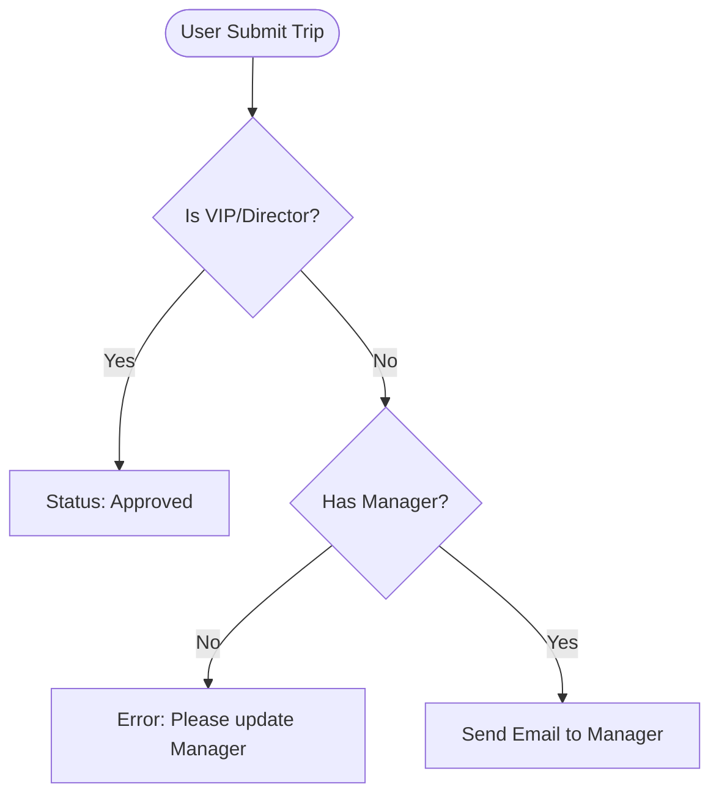

# Trips Management System - Workflow Fixes & logic Reconstruction

Tài liệu này phân tích các lỗ hổng logic hiện tại của hệ thống và đề xuất quy trình (workflow) mới để vá lỗi, đảm bảo vận hành an toàn và chặt chẽ.

## 1. Phân Tích Lỗ Hổng & Rủi Ro (Current Vulnerabilities)

| STT | Vấn đề (Issue) | Mô tả Rủi ro (Risk Description) | Mức độ |
|---|---|---|---|
| 1 | **Lỗ hổng "Self-Proclaimed CEO"** | Hệ thống hiện tại auto-approve nếu `user.manager_email` bị rỗng. User có thể xóa manager trong profile để được duyệt tự động. | 🔴 Critical |
| 2 | **Join Request Bypass** | Khi nhân viên xin đi ké xe (Join Request), yêu cầu gửi thẳng cho Admin. Manager trực tiếp không được duyệt, mất kiểm soát nhân sự. | 🟠 High |
| 3 | **Passive Expiration** | Trip quá hạn 48h (Approval Token hết hạn) nhưng vẫn treo ở trạng thái `Pending` nếu Manager không click link. User không biết để xử lý lại. | 🟡 Medium |
| 4 | **Silent Optimization** | Khi Admin duyệt gộp xe (Optimize), hệ thống không báo lại cho User biết chuyến đi đã thay đổi (xe chung, giờ mới). Gây bối rối khi khởi hành. | 🟡 Medium |

---

## 2. Đề Xuất Quy Trình Mới (Proposed Workflow)

### 2.1. Logic Auto-Approval (Vá lỗ hổng #1)
Không bao giờ dựa vào việc "thiếu dữ liệu" (empty `manager_email`) để cấp quyền ưu tiên.

**Logic Mới:**
1.  **Chỉ Auto-Approve khi thỏa mãn 1 trong các điều kiện:**
    *   `User.Role` = `'admin'` (Admin đi công tác tự duyệt).
    *   Hoặc `User.JobTitle` chứa các từ khóa lãnh đạo: *"Director", "General Manager", "CEO", "Head of"*.
    *   Hoặc `User.Email` nằm trong **VIP_WHITELIST** (Cấu hình trong Env/Database).
2.  **Còn lại (Mặc định):**
    *   Bắt buộc phải có `manager_email`.
    *   Nếu thiếu `manager_email` -> **Block Submit** -> Yêu cầu User cập nhật Profile.

### 2.2. Logic Join Request (Vá lỗ hổng #2)
Thêm bước duyệt của Manager trực tiếp trước khi chuyển sang Admin xử lý kỹ thuật.

**Quy trình:**
1.  **Requester (Nhân viên A)** tạo Join Request vào chuyến xe của **Host (Nhân viên B)**.
2.  **Step 1:** Hệ thống gửi email cho **Manager của A**.
3.  **Manager của A** duyệt (Confirmed: "Tôi đồng ý cho A đi chuyến này").
4.  **Step 2:** Sau khi Manager duyệt, hệ thống mới gửi thông báo cho **Admin**.
5.  **Admin** kiểm tra ghế trống/lộ trình -> Final Approve -> Add A vào chuyến đi.

### 2.3. Logic Xử lý Quá Hạn (Vá lỗ hổng #3)
Chuyển từ "Passive" sang "Active Check".

**Giải pháp kỹ thuật:**
1.  **API Check Lazy:** Mỗi khi Admin hoặc User load danh sách Trips (`GET /api/trips`), hệ thống chạy ngầm một hàm `checkExpiredTrips()`:
    *   Quét các trip `pending` có `created_at < (Now - 48h)`.
    *   Auto convert status sang `expired` (hoặc `rejected`).
    *   Gửi email thông báo cho User: "Yêu cầu đã hết hạn do Manager không phản hồi".
2.  **Cron Job (Optional):** Nếu deploy trên Vercel, dùng Vercel Cron để gọi API `/api/cron/check-expiration` mỗi giờ 1 lần.

### 2.4. Logic Thông báo Optimization (Vá lỗ hổng #4)
Minh bạch hóa quá trình tối ưu.

**Quy trình:**
1.  Admin review `Optimization Group` (nhóm các trip được gộp).
2.  Admin click **Confirm Group**.
3.  Hệ thống update status các trip con -> `Optimized`.
4.  **Action Mới:** Hệ thống gửi email **"Trip Update Notification"** cho từng User trong nhóm:
    *   Tiêu đề: *Thay đổi thông tin chuyến đi*.
    *   Nội dung: "Chuyến đi của bạn đã được tối ưu gộp xe. Giờ khởi hành mới: X, Loại xe: Y (Xe chung)."

### 2.5. Cơ chế Chống Thay Đổi Manager Trục Lợi (Vá lỗ hổng #5)
User cố tình đổi Manager sang người khác (hoặc email giả) để né duyệt.

**Giải pháp "Dual Notification & Confirmation Lock":**
1.  **Locking (Khóa trạng thái):**
    *   Khi User đổi Manager: Hệ thống lưu manager mới vào `pending_manager_email`.
    *   Manager **CŨ** vẫn giữ nguyên quyền hạn (vẫn nhận email approve trips) cho đến khi Manager **MỚI** xác nhận.
    *   Nếu chưa có Manager cũ (lần đầu setup): Block submit trip cho đến khi Manager mới confirm.
2.  **Dual Notification (Thông báo kép):**
    *   Gửi email cho **Manager Mới**: "Vui lòng xác nhận bạn là quản lý của nhân viên X".
    *   Gửi email cho **Manager Cũ**: "Nhân viên X đã yêu cầu đổi sang quản lý mới là Y. Nếu đây là lỗi, vui lòng báo lại."
3.  **Anti-Spam:** Giới hạn đổi Manager tối đa **1 lần/tháng** (muốn đổi thêm phải nhờ Admin).

---

## 3. Implementation Plan (Kế hoạch thực hiện)

### Phase 1: Security Fix (Làm ngay)
- [ ] Sửa `app/api/trips/submit/route.ts`:
    - Thay thế check `!manager_email` bằng check `whitelist` hoặc `job_title`.
    - Block submit nếu user thường mà không có manager.
    - Validate chặt chẽ `manager_email` (đuôi domain công ty).

### Phase 2: Workflow Upgrade
- [ ] Update `lib/join-request-service.ts`: Thêm trạng thái `manager_approved` cho Join Request.
- [ ] Update `lib/mysql-service.ts` (Approve Optimization): Thêm hàm gửi email thông báo sau khi update.

### Phase 3: Automation
- [ ] Tạo API endpoint `/api/cron/cleanup-expired`: Quét và xử lý trip treo.
- [ ] Cấu hình Vercel Cron (nếu deploy Vercel) hoặc Window Scheduled Task (nếu chạy local server/VM).

---
*Tài liệu này được tạo bởi AI Assistant ngày 31/12/2025.*
