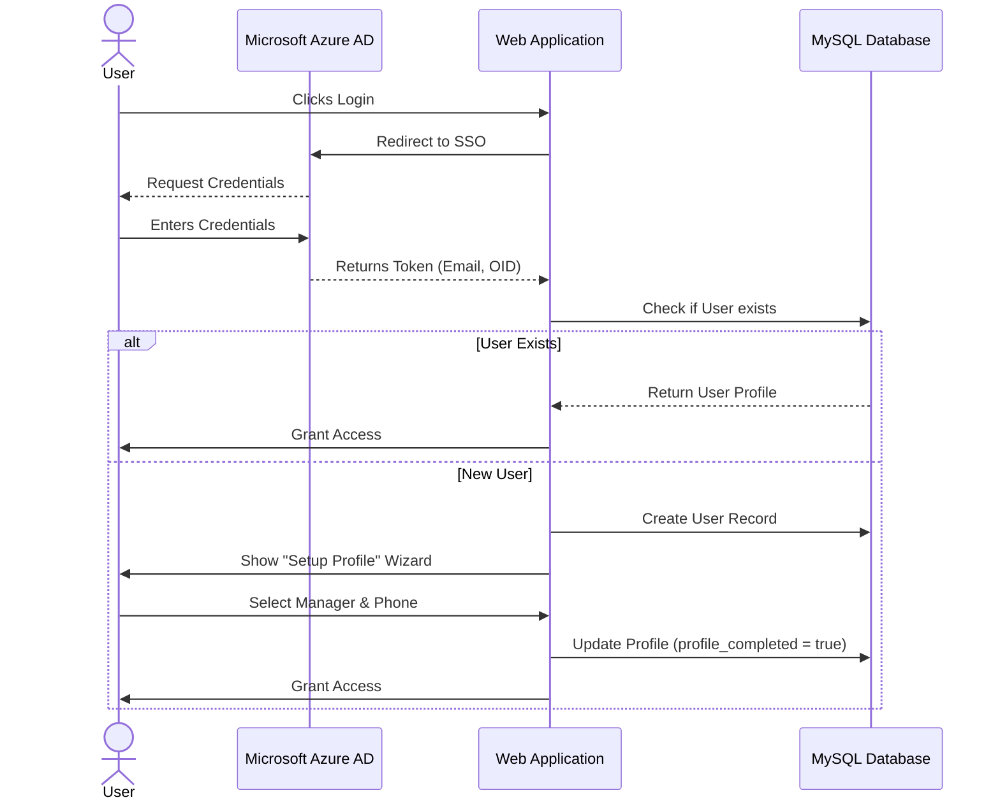
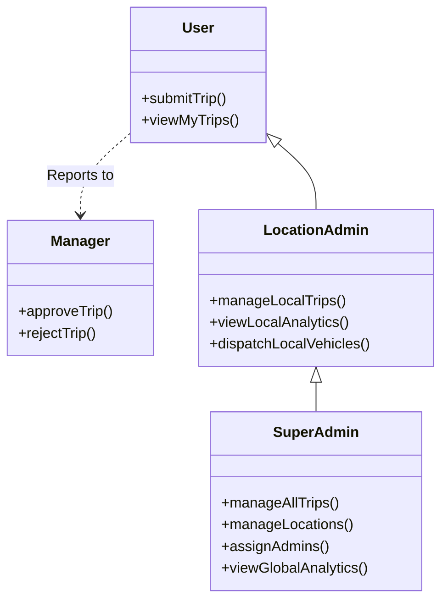
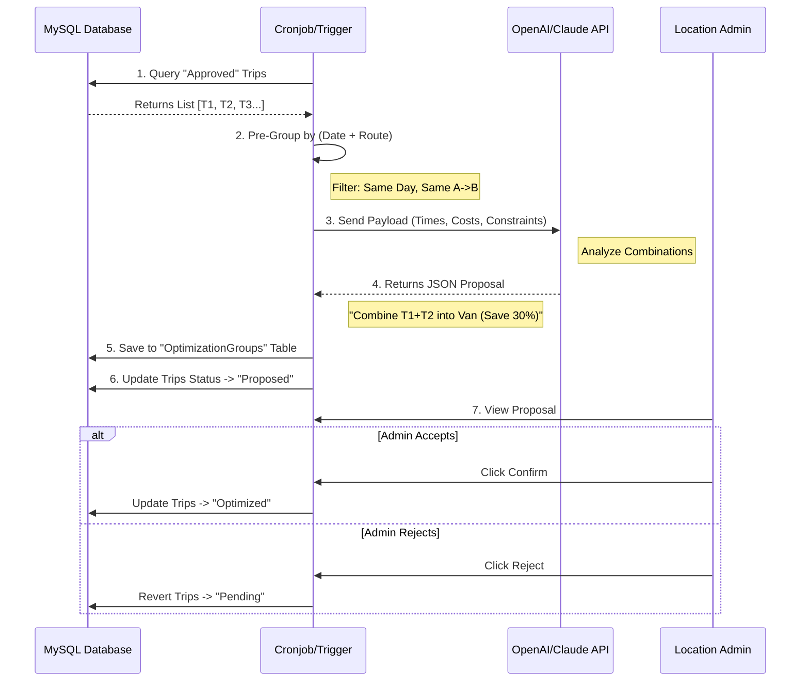

# Trips Management System - Master Workflow

## 1. Complete Operational Workflow (Overview)

This diagram illustrates the entire lifecycle of a trip request: from User Login -> AI Optimization -> Final Dispatch.

```mermaid
flowchart TD
    %% Define Styles
    classDef actor fill:#f9f,stroke:#333,stroke-width:2px;
    classDef system fill:#e1f5fe,stroke:#0277bd,stroke-width:2px;
    classDef decision fill:#fff9c4,stroke:#fbc02d,stroke-width:2px,stroke-dasharray: 5 5;
    classDef db fill:#e0e0e0,stroke:#333,stroke-width:2px,shape:cylinder;
    classDef email fill:#f3e5f5,stroke:#7b1fa2,stroke-width:2px;
    classDef ai fill:#e8f5e9,stroke:#2e7d32,stroke-width:2px;

    %% ACTORS
    User((User/Employee)):::actor
    Manager((Manager)):::actor
    Admin((Location Admin)):::actor
    AI_Engine{{AI Optimizer}}:::ai

    %% PHASE 1: AUTHENTICATION & ONBOARDING
    subgraph Phase1 ["PHASE 1: Authentication & Setup"]
        Start([Start]) --> Login[Login via Microsoft Azure AD]
        Login -- SSO Token --> CheckProfile{First Time?}:::decision
        CheckProfile -- Yes --> SetupWizard[Wizard: Select Manager & Contact Info]
        SetupWizard --> SaveProfile[(Save to MySQL)]:::db
        CheckProfile -- No --> Dashboard[User Dashboard]
    end

    User --> Start

    %% PHASE 2: SUBMISSION & VALIDATION
    subgraph Phase2 ["PHASE 2: Trip Submission Logic"]
        Dashboard --> SubmitTrip[Submit Request]
        SubmitTrip --> LogicCheck{System Checks}:::decision
        
        LogicCheck -- "VIP / No Manager" --> AutoApp[Auto-Approve]
        LogicCheck -- "Normal User" --> CheckTime{Departure < 24h?}:::decision
        
        CheckTime -- Yes --> Urgent[Status: Pending Urgent]
        CheckTime -- No --> Normal[Status: Pending Approval]
        
        AutoApp --> ApprovedState
    end

    %% PHASE 3: APPROVAL PROCESS
    subgraph Phase3 ["PHASE 3: Manager Approval via Email"]
        Normal --> BuildEmail[Generate JWT Link]:::system
        Urgent --> BuildEmail
        
        BuildEmail --> SendMail[Send Email to Manager]:::email
        SendMail -.-> Manager
        
        Manager -- Click Link --> VerifyJWT{Verify Token}:::decision
        VerifyJWT -- Valid --> ManagerAction{Action?}:::decision
        
        ManagerAction -- Approve --> ApprovedState[Status: APPROVED]
        ManagerAction -- Reject --> RejectedState[Status: REJECTED]
        
        ApprovedState -- Notify --> User
        RejectedState -- Notify --> User
    end

    %% PHASE 4: AI OPTIMIZATION
    subgraph Phase4 ["PHASE 4: AI Cost Optimization"]
        ApprovedState --> Pool[(Approved Trips Pool)]:::db
        Pool -- Scheduled Scan --> Grouping[Group by Date & Route]
        
        Grouping -- "Single Trip" --> Solo[Status: Approved Solo]
        Grouping -- "Multiple Trips" --> CallAI[Call OpenAI/Claude]:::ai
        
        CallAI --> AIResult{Savings found?}:::decision
        AIResult -- Yes --> Proposal[Create "Optimization Proposal"]
        AIResult -- No --> Solo
        
        Proposal --> AdminDash[Admin Dashboard]
    end

    %% PHASE 5: DISPATCH
    subgraph Phase5 ["PHASE 5: Final Dispatch"]
        AdminDash -.-> Admin
        Admin -- "Confirm Proposal" --> Optimized[Status: OPTIMIZED]
        Admin -- "Reject Proposal" --> Solo
        
        Optimized --> AssignDriver[Assign Driver & Vehicle]
        Solo --> AssignDriver
        
        AssignDriver --> End([End Logic])
    end

    %% LINKS
    SaveProfile --> Dashboard
```

---

## 2. Detailed Technical Diagrams

### A. Authentication & User Onboarding Flow



### B. Deployment & Permission Hierarchy



### C. Trip State Machine & Exception Handling

This comprehensive state diagram shows the complete lifecycle of a trip, including all status transitions and exception paths (Urgent, Expired, Auto-Approved).

```mermaid
stateDiagram-v2
    [*] --> PendingApproval: User Submits
    
    state "Validation Logic" as Validation {
        PendingApproval --> PendingUrgent: Time < 24h
        PendingApproval --> AutoApproved: No Manager / VIP
        PendingApproval --> PendingApproval: Standard Trip
    }

    state "Approval Process" as Approval {
        PendingUrgent --> Approved: Manager Approves (Fast)
        PendingUrgent --> Approved: Admin Override (Force Approve)
        PendingApproval --> Approved: Manager Approves
        PendingApproval --> Rejected: Manager Rejects
        
        state "Timeout Handling" as Timeout {
            PendingApproval --> Expired: 48h Silence
            PendingUrgent --> Expired: Past Departure Time
            Expired --> PendingApproval: Admin Resends Link
            Expired --> Cancelled: No Action Taken
        }
    }

    state "Optimization Phase" as Optimization {
        AutoApproved --> ReadyForAI
        Approved --> ReadyForAI
        
        ReadyForAI --> Optimized: AI Finds Combination
        ReadyForAI --> ApprovedSolo: No Combination Found / Rejected by Admin
    }

    Rejected --> [*]
    Cancelled --> [*]
    Optimized --> [*]
    ApprovedSolo --> [*]
```

### D. AI Logic Data Flow (How it really works)



### E. Urgent Trip Escalation Workflow

```mermaid
flowchart TD
    Start([User Submits Trip]) --> CheckTime{Departure < 24h?}
    
    CheckTime -- No --> Normal[Normal Flow]
    CheckTime -- Yes --> SetUrgent[Set is_urgent=1]
    
    SetUrgent --> NotifyManager[Email Manager (Priority Subject)]
    SetUrgent --> Dashboard[[Admin Dashboard]]
    
    Dashboard --> Highlight{Highlight RED}
    
    Highlight --> Monitor[Admin Monitors]
    
    Monitor --> CheckApproval{Manager Approved?}
    
    CheckApproval -- Yes --> Done([Ready to Go])
    CheckApproval -- No --> CheckDeadline{Time Critical?}
    
    CheckDeadline -- "Not Yet" --> Wait[Wait more]
    CheckDeadline -- "CRITICAL!" --> Override[Admin Click 'Force Approve']
    
    Override --> Log[Log: Approved by Admin]
    Log --> Done
```
